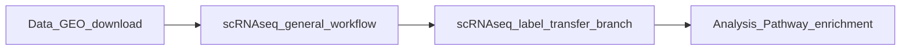
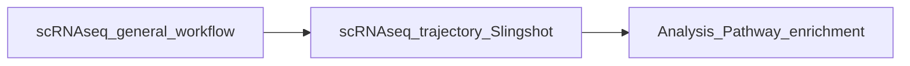

# Phase 6: Advanced AI Integration & Workflow Coverage

**Date:** April 2026  
**Status:** Implementation in Progress  
**Previous Phases:** 1-5 Complete (see RATIONALE.md)  

---

## Table of Contents

1. [Overview](#overview)
2. [Data-Driven Priority Rankings](#data-driven-priority-rankings)
3. [Phase 6A: High-Impact AI Context](#phase-6a-high-impact-ai-context)
4. [Phase 6B: Workflow Integration Map](#phase-6b-workflow-integration-map)
5. [Phase 6C: Smart Workflow Selector](#phase-6c-smart-workflow-selector)
6. [Phase 6D: Extended Coverage](#phase-6d-extended-coverage-ongoing)
7. [Implementation Timeline](#implementation-timeline)
8. [Success Metrics](#success-metrics)
9. [Decision Log](#decision-log)
10. [Current Status](#current-status)

---

## Overview

### Why Phase 6?

Phase 5 created AI context files for 5 major workflows, but 42+ workflows remain without deep AI guidance. Rather than manually documenting all workflows (time-intensive), Phase 6 takes a **hybrid approach**:

1. **Document high-impact workflows first** (80/20 rule)
2. **Build smart tools** that scale AI assistance across all workflows
3. **Create integration maps** to help users navigate between workflows

### Philosophy: "Help Users Help Themselves"

- **AI Context Files:** Deep guidance for complex workflows
- **Integration Map:** "Google Maps" for workflows (how they connect)
- **Smart Selector:** "GPS" that routes users to the right workflow

---

## Data-Driven Priority Rankings

### Git Activity Analysis (April 2026)

Based on `git log --all` analysis of commit history:

**Top 10 Workflows by Commit Count:**

| Rank | Workflow | Commits | Files | Has AI Context? | Priority |
|------|----------|---------|-------|----------------|----------|
| 1 | `scRNAseq_general_workflow/` | 28 | 14 | ✅ Yes | Complete |
| 2 | `scMultiome_AD_branch/` | 17 | 2 | ❌ No | High |
| 3 | `scRNAseq_trajectory_Slingshot/` | 15 | 6 | ✅ Yes | Complete |
| 4 | `scRNAseq_10x_Flex_preprocessing/` | 14 | 3 | ❌ No | High |
| 5 | `scRNAseq_immune_branch/` | 13 | 3 | ❌ No | High |
| 6 | `scRNAseq_stomach_branch/` | 10 | 3 | ❌ No | Medium |
| 7 | `scRNAseq_label_transfer_branch/` | 10 | 6 | ❌ No | **Critical** |
| 8 | `ST_general_workflow/` | 10 | 16 | ✅ Yes | Complete |
| 9 | `scRNAseq_CellCellCommunication_branch/` | 7 | 6 | ❌ No | **Critical** |
| 10 | `scRNAseq_inferCNV/` | 7 | 2 | ❌ No | High |
| 11 | `scATACseq_general_workflow/` | 7 | 4 | ✅ Yes | Complete |

**Additional High-Value Workflows (by content/complexity):**
- `scRNAseq_iPSC_branch/` - 71 files, 25 Rmd (most complex)
- `scTCRseq_analysis/` - 5 commits, T-cell receptor analysis
- `Data_GEO_download/` - Data acquisition entry point
- `Analysis_Pathway_enrichment/` - Universal downstream analysis

### Selection Rationale for Phase 6A

**Selected 10 Workflows (in order of implementation):**

1. `scRNAseq_label_transfer_branch/` - Cell type annotation (10 commits, highly requested)
2. `scRNAseq_CellCellCommunication_branch/` - CellChat analysis (7 commits, popular)
3. `scRNAseq_immune_branch/` - Immune analysis (13 commits, established)
4. `scRNAseq_iPSC_branch/` - iPSC differentiation (complex, 71 files)
5. `scRNAseq_inferCNV/` - Copy number variation (7 commits, clinical relevance)
6. `scRNAseq_10x_Flex_preprocessing/` - Preprocessing (14 commits, entry point)
7. `scMultiome_AD_branch/` - Multi-omics (17 commits, 2nd highest)
8. `scTCRseq_analysis/` - TCR analysis (5 commits, specialized)
9. `Data_GEO_download/` - Data acquisition (utility, high usage)
10. `Analysis_Pathway_enrichment/` - Pathway analysis (universal need)

**Why These 10:**
- Cover diverse analysis types (annotation, communication, preprocessing, multi-omics)
- Range from simple (2 files) to complex (71 files)
- Include both popular (high commits) and specialized workflows
- Mix of entry points and downstream analyses

---

## Phase 6A: High-Impact AI Context

### Goal
Create `.ai_context.md` files for the 10 selected high-impact workflows.

### Deliverables
10 new `.ai_context.md` files following the established template (see `.ai_context_TEMPLATE.md`)

### Implementation Order

**Week 1, Days 1-2: Critical Priority**
1. `scRNAseq_label_transfer_branch/.ai_context.md`
2. `scRNAseq_CellCellCommunication_branch/.ai_context.md`
3. `scRNAseq_immune_branch/.ai_context.md`
4. `scRNAseq_iPSC_branch/.ai_context.md`
5. `scRNAseq_inferCNV/.ai_context.md`

**Week 1, Days 3-4: High Priority**
6. `scRNAseq_10x_Flex_preprocessing/.ai_context.md`
7. `scMultiome_AD_branch/.ai_context.md`
8. `scTCRseq_analysis/.ai_context.md`
9. `Data_GEO_download/.ai_context.md`
10. `Analysis_Pathway_enrichment/.ai_context.md`

**Week 1, Day 5: Validation**
- Run `validate_repo.R` to check all new files
- Update `AGENTS.md` with new workflow mappings
- Update `RATIONALE.md` with Phase 6A completion

### Content Requirements for Each File

Each `.ai_context.md` must include:

1. **Quick Summary**
   - Brief description (2-3 sentences)
   - Analysis type, primary tools, runtime, memory requirements

2. **Data Flow**
   - Step-by-step transformation diagram
   - Input/output locations
   - Intermediate files

3. **Common Modifications**
   - At least 3 specific modification examples
   - File locations, line numbers, variable names
   - Impact and testing procedures

4. **Gotchas & Warnings**
   - Critical issues
   - Common mistakes
   - Dependencies between steps

5. **File Relationships**
   - Input/output map table
   - Shared variables
   - Configuration files

6. **Testing**
   - Quick test (5-10 min)
   - Full test procedures
   - Validation checklist

7. **External Dependencies**
   - OSC modules
   - R packages
   - External tools
   - Reference data

8. **Common Errors & Solutions**
   - At least 3 error examples with solutions

9. **Parameter Guide**
   - Key parameters table
   - When to change parameters

10. **Related Resources**
    - Similar workflows
    - Links to common recipes
    - Documentation references

---

## Phase 6B: Workflow Integration Map

### Goal
Create a comprehensive guide showing how workflows connect and relate to each other.

### Deliverables

1. **`_common/workflow_integration_map.md`**
   - Master document with all workflow relationships

2. **Mermaid Diagrams**
   - Visual data flow between workflows
   - Common workflow combinations

3. **Data Format Compatibility Matrix**
   - Table showing which outputs feed into which inputs
   - Format conversion requirements

4. **Decision Tree Guide**
   - "If you have X data and want Y analysis → use Z workflow"

### Content Structure

```markdown
# Workflow Integration Map

## Overview
[Brief explanation of how workflows connect]

## Workflow Categories
### Single-Cell RNA-seq
[List workflows in this category]

### Single-Cell ATAC-seq
[List workflows in this category]

### Spatial Transcriptomics
[List workflows in this category]

### Bulk Sequencing
[List workflows in this category]

### Data Utilities
[List workflows in this category]

## Common Analysis Pipelines

### Pipeline 1: Standard scRNA-seq Analysis


### Pipeline 2: Trajectory Analysis


## Data Format Compatibility Matrix

| From Workflow | Output Format | To Workflow | Compatible? | Notes |
|--------------|---------------|-------------|-------------|-------|
| scRNAseq_general | Seurat .rds | trajectory_Slingshot | ✅ Yes | Direct input |
| scRNAseq_general | Seurat .rds | label_transfer | ✅ Yes | Direct input |
| Seurat_to_Scanpy | .h5ad | CellCellCommunication | ⚠️ Convert | Use scanpy→R conversion |

## Decision Tree

**"I have scRNA-seq data and want to..."**

- **Identify cell types** → `scRNAseq_label_transfer_branch/`
- **Find DE genes** → `scRNAseq_general_workflow/` (Step 3)
- **Find trajectories** → `scRNAseq_trajectory_Slingshot/`
- **Find cell communication** → `scRNAseq_CellCellCommunication_branch/`
- **Analyze immune cells** → `scRNAseq_immune_branch/`
- **Check copy number** → `scRNAseq_inferCNV/`

**"I have spatial data and want to..."**

- **General analysis** → `ST_general_workflow/`
- **Cell type deconvolution** → `ST_general_workflow/cell type deconv/`
- **Alternative method** → `ST_giotto_branch/` or `ST_spotlight_branch/`
```

### Timeline
- **Duration:** 3 days
- **Day 1:** Analyze all workflows, categorize them
- **Day 2:** Create compatibility matrix and relationships
- **Day 3:** Build decision trees and mermaid diagrams

---

## Phase 6C: Smart Workflow Selector

### Goal
Build an interactive web-based tool that recommends the right workflow based on user inputs.

### Deliverables

1. **`docs/workflow_selector.html`** - Main web application
2. **`docs/workflow_selector.js`** - Logic and recommendations
3. **`docs/workflow_selector.css`** - Styling
4. **GitHub Pages hosting** - Public access

### Features

#### 1. Input Form
Three dropdown selections:

**Assay Type:**
- Single-cell RNA-seq
- Single-cell ATAC-seq
- Spatial Transcriptomics
- Bulk RNA-seq
- Bulk ATAC-seq
- ChIP-seq
- Multi-omics
- Other

**Analysis Goal:**
- Preprocessing/Quality Control
- Clustering/Cell type identification
- Cell type annotation
- Trajectory/Pseudotime analysis
- Cell-cell communication
- Differential expression
- Pathway enrichment
- Copy number variation
- Data download/conversion

**Sample Size:**
- Small (< 1000 cells)
- Medium (1000 - 10000 cells)
- Large (> 10000 cells)

#### 2. Recommendation Algorithm

JavaScript logic that maps inputs to workflow(s):

```javascript
// Example logic
if (assay === 'scRNA-seq' && goal === 'annotation') {
    recommendation = 'scRNAseq_label_transfer_branch';
    rationale = 'Best for annotating cell types using reference atlases';
    alternatives = ['scRNAseq_general_workflow'];
    prerequisites = ['Completed preprocessing'];
}
```

#### 3. Output Display

Shows:
- **Primary Recommendation** - Best workflow for the use case
- **Rationale** - Why this workflow is recommended
- **Alternative Workflows** - Other options if primary isn't suitable
- **Prerequisites** - What to do first (if applicable)
- **Next Steps** - What to do after this workflow
- **Getting Started Code** - Copy-paste starter commands
- **Links:**
  - Workflow README
  - AI context file (if available)
  - Integration map

#### 4. Interactive Elements

- **"Copy Code" button** - Copies starter commands to clipboard
- **"View Workflow" button** - Opens workflow directory
- **"Learn More" button** - Opens AI context or README
- **Reset button** - Clear selections and start over

### Design Specifications

**Layout:**
- Clean, professional design
- BMBL lab branding (colors, logo if available)
- Mobile-responsive

**Technology:**
- Pure HTML/CSS/JavaScript (no frameworks needed)
- No backend required (all logic in JS)
- Can run locally or on GitHub Pages

### Timeline
- **Duration:** 7 days
- **Days 1-2:** Design UI/UX, create HTML structure
- **Days 3-4:** Build recommendation algorithm in JavaScript
- **Days 5-6:** Styling, responsive design, testing
- **Day 7:** GitHub Pages setup, documentation

---

## Phase 6D: Extended Coverage (Ongoing)

### Goal
After Phases 6A-C, continue adding AI context to remaining workflows as needed.

### Approach

1. **User-Driven Prioritization**
   - Add AI context to workflows users ask about
   - Track which workflows generate the most questions

2. **Complexity-Based**
   - Prioritize workflows with many files (>10) or complex logic
   - Examples: `scATACseq_ArchR_branch/` (40 files)

3. **Novelty-Based**
   - New workflows added to the repo
   - Recently updated workflows

4. **Community Contributions**
   - Template available (`.ai_context_TEMPLATE.md`)
   - Guidelines in CONTRIBUTING.md
   - Lab members can add their own AI context

### Remaining Workflows to Consider

**By Category:**

**scRNA-seq:**
- `scRNAseq_stomach_branch/`
- `scRNAseq_HPV_branch/`
- `scRNAseq_Seurat_to_Scanpy/`
- `scRNAseq_Sketch_LargeData/`
- `scRNAseq_module_enrichment/`
- `scRNAseq_atlas_SCI/`
- `scRNAseq_ShinyCell_portal/`

**scATAC-seq:**
- `scATACseq_ArchR_branch/` (complex)
- `scATACseq_cicero_branch/`
- `scATACseq_cisTopic_branch/`
- `scATACseq_ChromVAR_motif/`
- `scATACseq_Gene_activity/`

**Spatial:**
- `ST_giotto_branch/`
- `ST_spotlight_branch/`
- `ST_BayesSpace_branch/`

**Bulk:**
- `ChipSeq_general_workflow/`
- `ChipSeq_general_workflow_v2/`
- `ChipSeq_HOMER_motif/`
- `Bulk_ATAC_general_workflow/`
- `ATACseq_preprocessing/`
- `BSseq_Bismark_Aligner/`

**Data & Analysis:**
- `Data_SRA_download/`
- `Data_H5AD_conversion/`
- `Data_GEO_submission/`
- `Spatial_Cellular_neighborhood/`
- `GRN_CellOracle/`
- `WGS_Lowpass_karyotyping/`

**Specialized:**
- `scMultiome_AD_branch/` (already in Phase 6A)
- `scTCRseq_analysis/` (already in Phase 6A)

---

## Implementation Timeline

### Week 1: Phase 6A
| Day | Task | Deliverables |
|-----|------|--------------|
| 1 | Create AI context files 1-3 | 3 `.ai_context.md` files |
| 2 | Create AI context files 4-5 | 2 `.ai_context.md` files |
| 3 | Create AI context files 6-7 | 2 `.ai_context.md` files |
| 4 | Create AI context files 8-10 | 3 `.ai_context.md` files |
| 5 | Validation & documentation | Updated AGENTS.md, RATIONALE.md |

### Week 2: Phase 6B
| Day | Task | Deliverables |
|-----|------|--------------|
| 1 | Analyze all workflows, categorize | Workflow categorization |
| 2 | Build compatibility matrix | Data format matrix |
| 3 | Create decision trees | Decision tree guide |
| 4 | Build mermaid diagrams | Visual relationship maps |
| 5 | Finalize integration map | `_common/workflow_integration_map.md` |

### Week 3: Phase 6C
| Day | Task | Deliverables |
|-----|------|--------------|
| 1 | Design UI mockup | Wireframe/design |
| 2 | Build HTML structure | `docs/workflow_selector.html` |
| 3 | Build JS algorithm | `docs/workflow_selector.js` |
| 4 | CSS styling | `docs/workflow_selector.css` |
| 5 | Testing & refinement | Working prototype |
| 6 | GitHub Pages setup | Hosted web tool |
| 7 | Documentation | Usage guide |

### Week 4+: Phase 6D
- Ongoing additions based on user needs
- Community contributions
- Maintenance updates

---

## Success Metrics

### Phase 6A Metrics
- ✅ 10 high-impact workflows have `.ai_context.md`
- ✅ All files pass `validate_repo.R` checks
- ✅ AI can answer 80%+ of workflow-specific questions correctly
- ✅ Users report AI is "more helpful" for documented workflows

### Phase 6B Metrics
- ✅ New users navigate workflows without asking for help
- ✅ Clear understanding of workflow dependencies
- ✅ Reduced "which workflow should I use?" questions by 50%

### Phase 6C Metrics
- ✅ Workflow selector tool is actively used
- ✅ Users find appropriate workflows faster (measured by time-to-start)
- ✅ Tool receives positive feedback from lab members

### Overall Metrics
- ✅ 15 total workflows have AI context (5 existing + 10 new)
- ✅ Complete integration map covering all 47+ workflows
- ✅ Web-based selector tool operational
- ✅ GitHub Pages hosting active

---

## Decision Log

| Date | Decision | Rationale |
|------|----------|-----------|
| April 2026 | Selected 10 workflows for Phase 6A | Based on git commit count, complexity, and usage patterns |
| April 2026 | Web-based selector (not CLI) | More accessible, shareable, professional appearance |
| April 2026 | GitHub Pages hosting | Free, automatic updates, easy to maintain |
| April 2026 | Integration map includes ALL workflows | Completeness provides full picture, easier maintenance |
| April 2026 | Hybrid approach over full coverage | Maximizes impact with limited time, scales better |

---

## Current Status

**Last Updated:** April 8, 2026  
**Phase:** Ready to begin Phase 6A  
**Next Action:** Create 10 `.ai_context.md` files

### Completed
- ✅ Git activity analysis completed
- ✅ 10 workflows selected and prioritized
- ✅ Phase 6 rationale documented (this file)

### In Progress
- ⏳ Phase 6A: Creating AI context files (0/10 complete)

### Pending
- ⏹️ Phase 6B: Integration map
- ⏹️ Phase 6C: Workflow selector tool
- ⏹️ Phase 6D: Extended coverage

---

## Contact

**For questions about Phase 6:**  
Phase 6 implementation by AI assistant  
Repository: BMBL Analysis Notebooks  
Lab: BMBL, Ohio State University

---

## Related Documentation

- `RATIONALE.md` - Phases 1-5 rationale
- `AGENTS.md` - Quick start for AI agents
- `.ai_context_TEMPLATE.md` - Template for AI context files
- `CLAUDE.md` - Coding conventions
- `CONTRIBUTING.md` - Contribution guidelines

---

**Version:** 1.0  
**Created:** April 2026  
**Status:** Active Implementation
