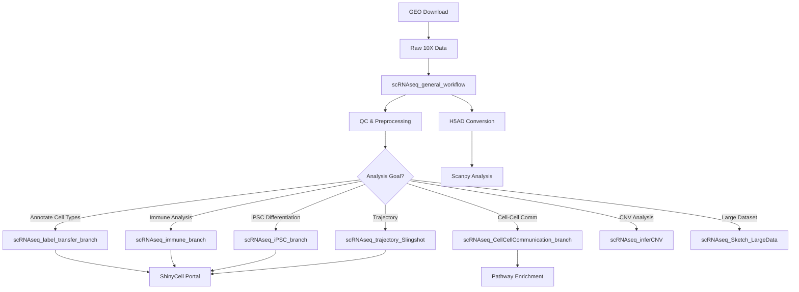
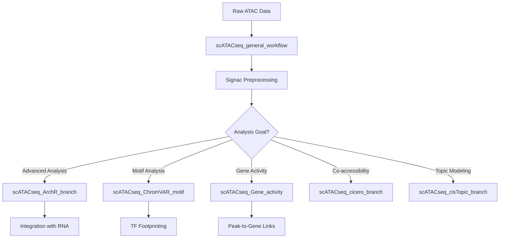
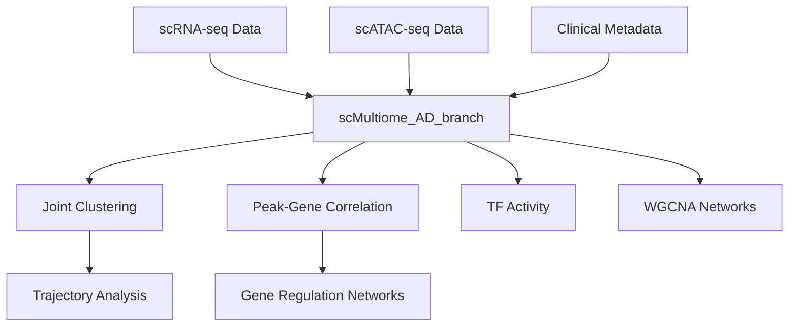
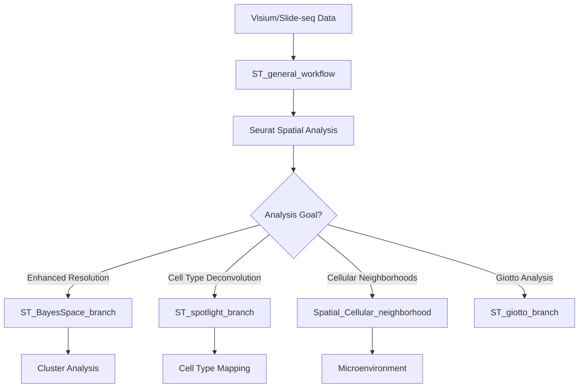
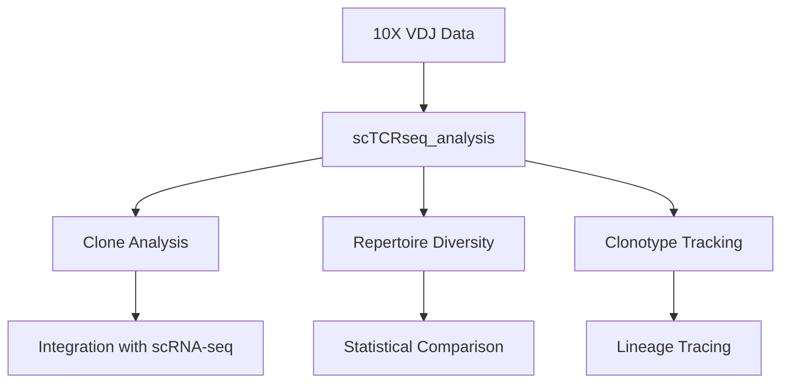
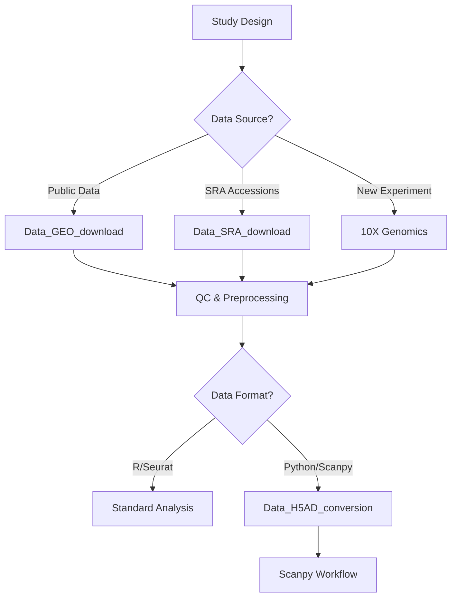
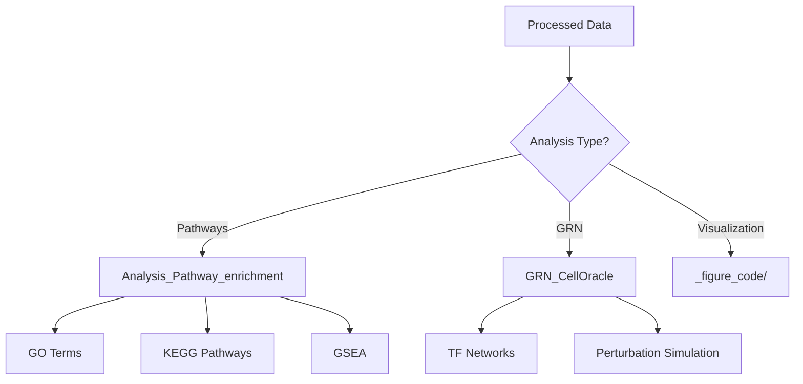

# BMBL Workflow Integration Map

**Purpose**: Visual guide showing how workflows connect, what data formats they use, and when to chain workflows together.

**Last Updated**: 2026-04-15

---

## Table of Contents

1. [Quick Reference](#quick-reference)
2. [Workflow Relationship Diagrams](#workflow-relationship-diagrams)
3. [Data Format Compatibility Matrix](#data-format-compatibility-matrix)
4. [Common Workflow Chains](#common-workflow-chains)
5. [Decision Tree](#decision-tree)

---

## Quick Reference

| Workflow Category | Count | Workflows |
|------------------|-------|-----------|
| scRNA-seq | 14 | general, label_transfer, CellCellComm, immune, iPSC, inferCNV, 10x_Flex, atlas_SCI, HPV, module_enrichment, Seurat_to_Scanpy, ShinyCell, Sketch_LargeData, stomach, trajectory |
| scATAC-seq | 7 | general, ArchR, ChromVAR, cicero, cisTopic, Gene_activity |
| scMultiome | 1 | AD_branch |
| Spatial Transcriptomics | 5 | general, BayesSpace, giotto, spotlight, Cellular_neighborhood |
| scTCR-seq | 1 | analysis |
| Bulk RNA-seq | 3 | nfcore, archived workflows |
| Bulk ATAC-seq | 2 | general, preprocessing |
| ChIP-seq | 3 | general, v2, HOMER_motif |
| Data Utilities | 4 | GEO_download, GEO_submission, H5AD_conversion, SRA_download |
| Analysis Tools | 3 | Pathway_enrichment, module_enrichment, GRN_CellOracle |
| Other | 3 | BSseq, WGS_karyotyping, _ChatGPT_prompts |

**Total**: 47+ workflow directories

---

## Workflow Relationship Diagrams

### 1. Single-Cell RNA-seq Ecosystem



### 2. Single-Cell ATAC-seq Ecosystem



### 3. Multi-omics Integration



### 4. Spatial Transcriptomics Ecosystem



### 5. TCR-seq Analysis Pipeline



### 6. Data Acquisition & Preparation



### 7. Downstream Analysis Workflows



---

## Data Format Compatibility Matrix

### Input Formats by Workflow

| Workflow | 10X | H5AD | RDS | CSV | FASTQ | BAM | GEO |
|----------|-----|------|-----|-----|-------|-----|-----|
| scRNAseq_general_workflow | ✓ | ✓ | ✓ | ✗ | ✗ | ✗ | ✗ |
| scRNAseq_label_transfer_branch | ✗ | ✓ | ✓ | ✗ | ✗ | ✗ | ✗ |
| scRNAseq_trajectory_Slingshot | ✗ | ✓ | ✓ | ✗ | ✗ | ✗ | ✗ |
| scRNAseq_CellCellCommunication_branch | ✗ | ✓ | ✓ | ✗ | ✗ | ✗ | ✗ |
| scRNAseq_inferCNV | ✗ | ✓ | ✓ | ✗ | ✗ | ✗ | ✗ |
| scRNAseq_10x_Flex_preprocessing | ✓ | ✗ | ✗ | ✗ | ✗ | ✗ | ✗ |
| scATACseq_general_workflow | ✓ | ✗ | ✗ | ✗ | ✗ | ✓ | ✗ |
| scATACseq_ArchR_branch | ✓ | ✗ | ✗ | ✗ | ✗ | ✓ | ✗ |
| scMultiome_AD_branch | ✓ | ✗ | ✗ | ✗ | ✗ | ✗ | ✗ |
| ST_general_workflow | ✓ | ✗ | ✗ | ✗ | ✗ | ✗ | ✗ |
| RNAseq_nfcore_workflow | ✗ | ✗ | ✗ | ✓ | ✓ | ✗ | ✗ |
| Data_GEO_download | ✗ | ✗ | ✗ | ✗ | ✗ | ✗ | ✓ |
| Data_H5AD_conversion | ✗ | ✓ | ✓ | ✗ | ✗ | ✗ | ✗ |
| scTCRseq_analysis | ✓ | ✗ | ✗ | ✗ | ✗ | ✗ | ✗ |

### Output Formats by Workflow

| Workflow | Seurat RDS | H5AD | CSV Tables | Figures | Reports |
|----------|------------|------|------------|---------|---------|
| scRNAseq_general_workflow | ✓ | ✓ | ✓ | ✓ | ✓ |
| scRNAseq_label_transfer_branch | ✓ | ✗ | ✓ | ✓ | ✓ |
| scRNAseq_trajectory_Slingshot | ✓ | ✗ | ✓ | ✓ | ✓ |
| scRNAseq_CellCellCommunication_branch | ✓ | ✗ | ✓ | ✓ | ✓ |
| scATACseq_general_workflow | ✓ | ✓ | ✓ | ✓ | ✓ |
| scMultiome_AD_branch | ✓ | ✗ | ✓ | ✓ | ✓ |
| RNAseq_nfcore_workflow | ✗ | ✗ | ✓ | ✓ | ✓ |
| ST_general_workflow | ✓ | ✓ | ✓ | ✓ | ✓ |

---

## Common Workflow Chains

### Chain 1: Complete scRNA-seq Analysis

**Scenario**: New single-cell RNA-seq dataset from 10X Genomics

```
Data_GEO_download (optional) 
    → scRNAseq_general_workflow (QC, clustering)
        → scRNAseq_label_transfer_branch (annotation)
            → scRNAseq_trajectory_Slingshot (pseudotime)
                → scRNAseq_CellCellCommunication_branch (cellchat)
                    → Analysis_Pathway_enrichment (pathways)
                        → scRNAseq_ShinyCell_portal (visualization)
```

**Estimated Time**: 3-5 days  
**Data Size**: 5-50 GB intermediate files  
**Key Decisions**:
- Cell type annotation method (SingleR, Seurat, manual)
- Number of clusters (resolution parameter)
- Trajectory root cell selection

### Chain 2: Multi-omics Integration

**Scenario**: 10X Multiome experiment (RNA + ATAC)

```
scRNAseq_general_workflow (RNA preprocessing)
    + scATACseq_general_workflow (ATAC preprocessing)
        → scMultiome_AD_branch (joint analysis)
            → scATACseq_Gene_activity (peak-gene links)
                → GRN_CellOracle (gene regulatory networks)
```

**Estimated Time**: 5-7 days  
**Data Size**: 20-100 GB intermediate files  
**Key Decisions**:
- Joint clustering weights (RNA vs ATAC)
- Peak calling parameters
- Linkage correlation threshold

### Chain 3: Spatial Transcriptomics

**Scenario**: 10X Visium spatial data

```
ST_general_workflow (basic analysis)
    → ST_spotlight_branch (cell type deconvolution)
        → Spatial_Cellular_neighborhood (microenvironment)
            → ST_BayesSpace_branch (enhanced resolution)
                → Analysis_Pathway_enrichment (pathway analysis)
```

**Estimated Time**: 3-4 days  
**Data Size**: 10-30 GB intermediate files  
**Key Decisions**:
- Number of HVGs for deconvolution
- Neighborhood radius
- BayesSpace cluster count

### Chain 4: Immune Repertoire + Expression

**Scenario**: 10X 5' Gene Expression + VDJ

```
scRNAseq_general_workflow (gene expression)
    + scTCRseq_analysis (VDJ analysis)
        → Integration (clonotype + expression)
            → scRNAseq_immune_branch (immune annotation)
                → scRNAseq_trajectory_Slingshot (lineage tracing)
```

**Estimated Time**: 2-4 days  
**Data Size**: 5-20 GB intermediate files  
**Key Decisions**:
- Clonotype grouping threshold
- Expansion definition
- T cell subset classification

### Chain 5: Large Dataset Analysis

**Scenario**: >100k cells dataset

```
scRNAseq_Sketch_LargeData (subsample analysis)
    → scRNAseq_general_workflow (full dataset mapping)
        → scRNAseq_label_transfer_branch (annotation)
            → scRNAseq_trajectory_Slingshot (pseudotime)
```

**Estimated Time**: 2-3 days  
**Data Size**: 50-200 GB intermediate files  
**Key Decisions**:
- Sketch size (typically 20-50k cells)
- Reference vs query mapping
- Integration method

### Chain 6: Disease-Specific Analysis (AD)

**Scenario**: Alzheimer's Disease multi-omics data

```
scMultiome_AD_branch (joint preprocessing)
    → WGCNA analysis
        → Pathway enrichment
            → scRNAseq_trajectory_Slingshot (trajectory)
                → Analysis_Pathway_enrichment (pathways)
```

**Estimated Time**: 4-6 days  
**Data Size**: 30-80 GB intermediate files  
**Key Decisions**:
- Soft-thresholding power
- Module preservation across groups
- Cell type specificity

---

## Decision Tree

### Starting Point: Raw Data

```
What is your data type?
│
├── 10X Genomics scRNA-seq
│   ├── Multiple samples to integrate?
│   │   ├── Yes → scRNAseq_general_workflow (integration)
│   │   └── No → scRNAseq_general_workflow (single sample)
│   │
│   ├── Need cell type annotation?
│   │   ├── Yes → scRNAseq_label_transfer_branch
│   │   └── No → Continue with manual annotation
│   │
│   ├── Analyzing trajectory/differentiation?
│   │   ├── Yes → scRNAseq_trajectory_Slingshot
│   │   └── No → Skip trajectory
│   │
│   ├── Cell-cell communication analysis?
│   │   ├── Yes → scRNAseq_CellCellCommunication_branch
│   │   └── No → Skip CCC
│   │
│   ├── Immune cell analysis?
│   │   ├── Yes → scRNAseq_immune_branch
│   │   └── No → Standard analysis
│   │
│   └── Large dataset (>100k cells)?
│       ├── Yes → scRNAseq_Sketch_LargeData
│       └── No → Standard workflow
│
├── 10X Genomics scATAC-seq
│   ├── Need ArchR-specific features?
│   │   ├── Yes → scATACseq_ArchR_branch
│   │   └── No → scATACseq_general_workflow (Signac)
│   │
│   ├── Motif/TF analysis?
│   │   ├── Yes → scATACseq_ChromVAR_motif
│   │   └── No → Skip motif analysis
│   │
│   └── Co-accessibility analysis?
│       ├── Yes → scATACseq_cicero_branch
│       └── No → Skip cicero
│
├── 10X Genomics Multiome (RNA+ATAC)
│   └── Use → scMultiome_AD_branch
│
├── 10X Genomics Visium/Spatial
│   ├── Need enhanced resolution?
│   │   ├── Yes → ST_BayesSpace_branch
│   │   └── No → ST_general_workflow
│   │
│   ├── Cell type deconvolution?
│   │   ├── Yes → ST_spotlight_branch
│   │   └── No → Skip deconvolution
│   │
│   └── Cellular neighborhood analysis?
│       ├── Yes → Spatial_Cellular_neighborhood
│       └── No → Skip neighborhoods
│
├── 10X Genomics VDJ (TCR/BCR)
│   └── Use → scTCRseq_analysis
│
├── Bulk RNA-seq
│   ├── Using nf-core pipeline?
│   │   ├── Yes → RNAseq_nfcore_workflow
│   │   └── No → Consider nf-core/rnaseq
│   │
│   └── Differential expression?
│       └── Use DESeq2/edgeR within workflow
│
├── Bulk ATAC-seq
│   └── Use → Bulk_ATAC_general_workflow
│
├── ChIP-seq
│   └── Use → ChipSeq_general_workflow or v2
│
└── Public Data (GEO/SRA)
    ├── GEO Series?
    │   └── Use → Data_GEO_download
    │
    ├── SRA accessions?
    │   └── Use → Data_SRA_download
    │
    └── Need format conversion?
        └── Use → Data_H5AD_conversion
```

### Downstream Analysis Decisions

```
After basic preprocessing, what analysis do you need?
│
├── Pathway/Functional enrichment
│   ├── GO/KEGG enrichment?
│   │   └── Use → Analysis_Pathway_enrichment
│   │
│   ├── GSEA (ranked gene lists)?
│   │   └── Use → Analysis_Pathway_enrichment (GSEA mode)
│   │
│   └── Module scoring?
│       └── Use → AddModuleScore in Seurat
│
├── Gene Regulatory Networks
│   └── Use → GRN_CellOracle
│
├── Visualization
│   ├── Static figures?
│   │   └── Use → _figure_code/ scripts
│   │
│   └── Interactive browser?
│       └── Use → scRNAseq_ShinyCell_portal
│
└── Data export
    ├── For Python/Scanpy?
    │   └── Use → Data_H5AD_conversion
    │
    └── For publication?
        └── Use → GEO submission templates
```

---

## File Format Conversion Guide

### Converting Between Formats

| From | To | Tool/Workflow | Notes |
|------|-----|---------------|-------|
| 10X | Seurat RDS | scRNAseq_general_workflow | Standard import |
| Seurat RDS | H5AD | Data_H5AD_conversion | For Scanpy |
| H5AD | Seurat RDS | Seurat::ReadH5AD | Limited support |
| Cell Ranger | Seurat | CreateSeuratObject | Direct import |
| ArchR | Seurat | ArchR::getGeneExpression | For multiome |
| Scanpy | Seurat | scRNAseq_Seurat_to_Scanpy | Bidirectional |

### When to Convert

- **To H5AD**: When collaborating with Python users or using Scanpy-specific tools
- **From H5AD**: When importing public datasets already in H5AD format
- **To RDS**: For long-term storage or sharing with R users
- **Between versions**: Use `UpdateSeuratObject` for older Seurat objects

---

## Performance Considerations

### Memory Requirements

| Workflow | Minimum RAM | Recommended RAM | Notes |
|----------|-------------|-----------------|-------|
| scRNAseq_general_workflow | 16 GB | 32-64 GB | Scales with cell count |
| scRNAseq_Sketch_LargeData | 16 GB | 32 GB | For >100k cells |
| scATACseq_general_workflow | 32 GB | 64-128 GB | ATAC is memory-intensive |
| scMultiome_AD_branch | 64 GB | 128 GB | Joint analysis needs more |
| ST_general_workflow | 16 GB | 32 GB | Spatial adds complexity |
| RNAseq_nfcore_workflow | 16 GB | 32 GB | Per sample |

### Compute Time Estimates

| Workflow | Small (<10k cells) | Medium (10-50k) | Large (>50k) |
|----------|-------------------|-----------------|--------------|
| scRNAseq_general_workflow | 1-2 hours | 2-4 hours | 4-8 hours |
| scATACseq_general_workflow | 2-4 hours | 4-8 hours | 8-16 hours |
| scMultiome_AD_branch | 4-8 hours | 8-16 hours | 16-32 hours |
| ST_general_workflow | 2-4 hours | 4-8 hours | 8-16 hours |
| scTCRseq_analysis | 30 min | 1-2 hours | 2-4 hours |

---

## Troubleshooting Workflow Chains

### Common Integration Issues

1. **Different sample qualities**
   - Solution: Use SCTransform or Harmony for integration
   - Workflow: scRNAseq_general_workflow (integration section)

2. **Batch effects after integration**
   - Solution: Check PC loadings, re-run with different k.anchor
   - Workflow: scRNAseq_general_workflow (troubleshooting)

3. **Inconsistent clustering**
   - Solution: Use joint clustering from multiome or label transfer
   - Workflow: scMultiome_AD_branch or scRNAseq_label_transfer_branch

### Memory Issues

1. **Out of memory during integration**
   - Solution: Use reference-based integration or sketch-based workflow
   - Workflow: scRNAseq_Sketch_LargeData

2. **ATAC analysis crashes**
   - Solution: Reduce tile size, use sparse matrices
   - Workflow: scATACseq_general_workflow (performance section)

### Format Compatibility Issues

1. **Cannot read H5AD in R**
   - Solution: Use SeuratDisk or anndata R package
   - Workflow: Data_H5AD_conversion

2. **Incompatible Seurat versions**
   - Solution: Update object with UpdateSeuratObject
   - General guidance

---

## Maintenance Notes

This integration map should be updated when:
- New workflows are added to the repository
- Existing workflows change their input/output formats
- New integration patterns are discovered
- Performance characteristics change significantly

**Update Frequency**: Review quarterly or after major workflow updates.

---

## See Also

- [AGENTS.md](../AGENTS.md) - General repository guide
- [ai_recipes.md](./ai_recipes.md) - Common code patterns
- Individual workflow `.ai_context.md` files - Detailed guidance per workflow
- [Smart Workflow Selector](../docs/workflow_selector.html) - Interactive tool
