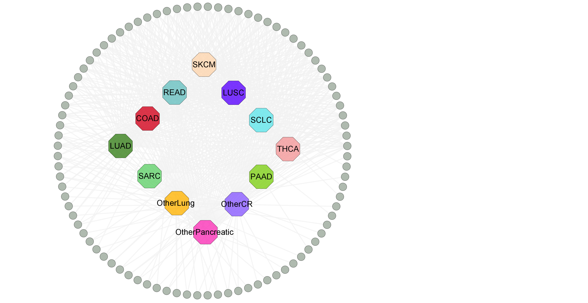
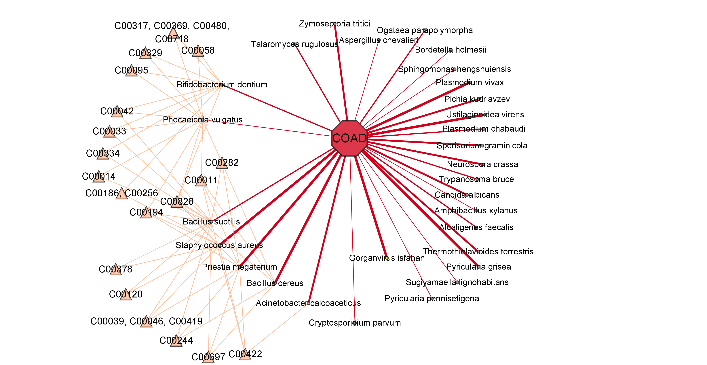
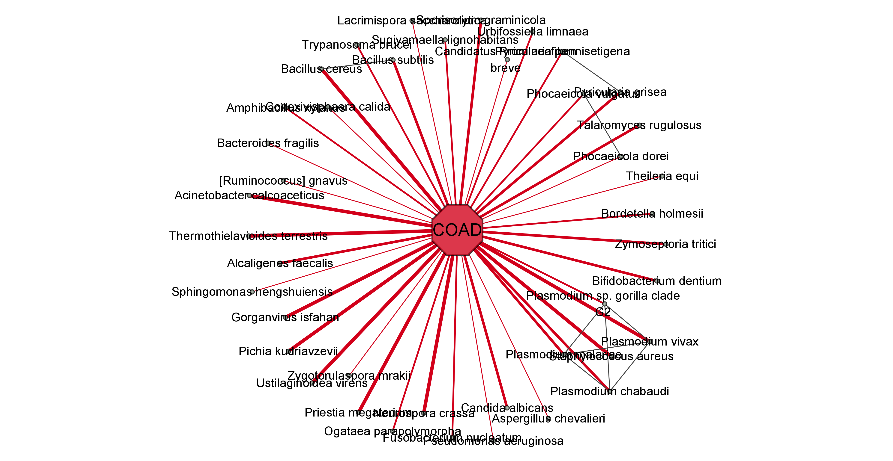

## Visualizing Networks using R and Cytoscape (Windows Only)

**Important Note:** The visualization code was created and tested using R and Cytoscape on Windows operating systems and is not compatible with terminal environments.

### Installation

The following packages are required for development:

- R: 4.2.1
- Cytoscape: 3.9.1
- Rcy3: 2.19.0
- igraph: 1.3.5
- tidyverse: 1.3.2
- reshape2: 1.4.4
- qs: 0.25.4

### How to Use

1. Open the desktop version of Cytoscape. The code requires the Rcy3 package to establish an API connection with the desktop Cytoscape.

2. It is recommended to run the code line by line in **Rstudio** for ease of adjusting network parameters.

### Plotting All Cancer Types

Refer to the file `plot_all_cancer.r`

**Example Output:**

### Plotting One Cancer with Metabolic Edge

Refer to the file `plot_one_cancer_with_metabolic_edge.r`

**Example Output:**

### Plotting One Cancer with Phylogenetic Edge

Refer to the file `plot_one_cancer_with_phylogenetic_edge.r`

**Example Output:**

**Sources:**
- R: https://en.wikipedia.org/wiki/R_(programming_language)
- Cytoscape: https://en.wikipedia.org/wiki/Cytoscape
