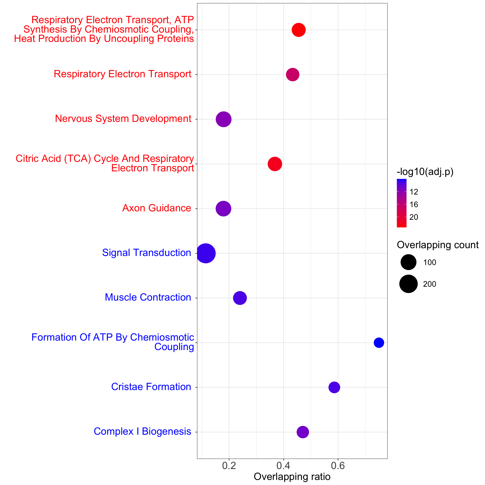

# Dot plot for enriched pathways

## Introduction

This document provides a comprehensive guide to generating pathway dot plots from a dataset of pathways. It walks through data cleaning, processing, and plotting using R libraries like `ggplot2` and `dplyr`. The final plot is a dot plot that visualizes gene overlaps and p-values in relation to each pathway term.

## Pipeline input

The input to this workflow is a CSV file, `example_pathways.csv`, which contains the pathway data. The required columns in this CSV file include:

- **Genes**: The genes associated with each pathway, separated by semicolons.
- **Adjusted.P.value**: Adjusted p-value for the pathway analysis.
- **Overlap**: The overlap ratio or fraction of genes in the pathway.
- **Term**: Pathway term names.
- **Direction**: Direction of change for each pathway, e.g., `"Up"` or `"Down"`.

## Pipeline output

The plot displays pathway terms with colors and sizes based on their properties, allowing for easy visual identification of significant pathways.



## Contact

Author: Cankun Wang

```

```
