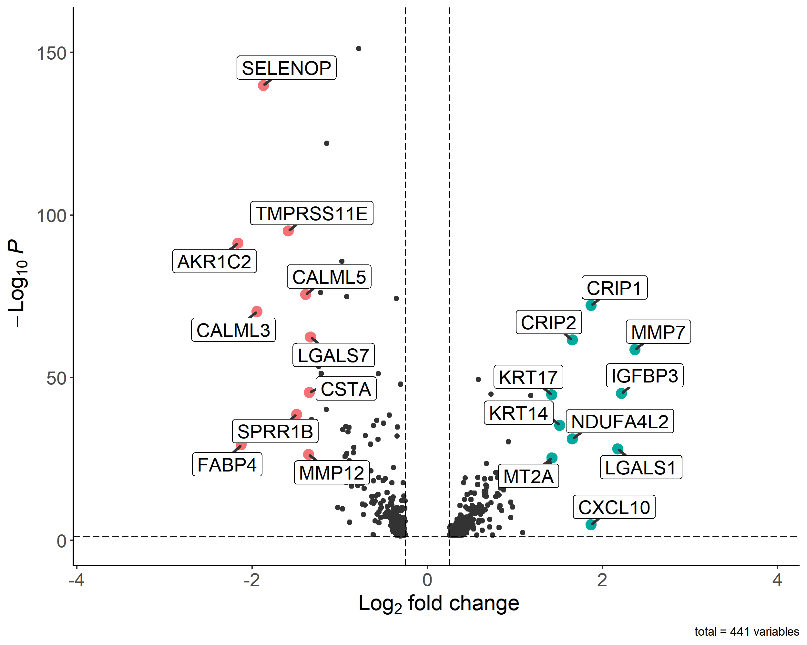

# Volcano Plot Visualization

## Overview

- **What it does:** Generates publication-quality volcano plots for visualizing differential expression analysis results, highlighting significant genes and top up/down-regulated genes.
- **Who it's for:** Researchers analyzing differential gene expression data who need to visualize and identify significant gene expression changes.
- **Key Features:**
  - Customizable color schemes for different gene expression patterns
  - Automatic highlighting of top up/down-regulated genes
  - Publication-ready output with customizable parameters
  - Interactive gene labels with connecting lines

---

## Getting Started

### Prerequisites

- **Software:** 
  - R (version 4.0.0 or higher)
  - Required R packages: tidyverse, EnhancedVolcano
- **Knowledge:** 
  - Basic understanding of differential expression analysis
  - Familiarity with R programming
  - Understanding of volcano plot interpretation

### Instruction

1. Install required R packages:
   ```R
   install.packages(c("tidyverse", "EnhancedVolcano"))
   ```
2. Prepare your differential expression results in CSV format
3. Modify the script parameters as needed
4. Run the volcano.R script

---

## Usage

### 1. Input Data

- **Required Format:** CSV file containing differential expression results with columns:
  - gene: Gene identifiers
  - avg_log2FC: Log2 fold change values
  - p_val_adj: Adjusted p-values

### 2. Running the Workflow

1. Place your differential expression results CSV file in the working directory
2. Open and run volcano.R
3. Adjust parameters as needed:
   - p-value cutoff (default: 0.05)
   - Fold change cutoff (default: 0.25)
   - Number of top genes to highlight (default: 10 up and down)

### 3. Testing with Sample Data

- **Command:** Run the script with the provided example file `clus.nofilter.clu1.vs.clu8.deg.csv`
- **Expected Output:** A volcano plot saved as `volcano.png` with:
  - Significant genes highlighted
  - Top up/down-regulated genes labeled
  - Custom color scheme

<p align="center">

</p>

### 4. Pipeline Output

- **volcano.png:** High-resolution volcano plot (2500x2000 pixels, 300 DPI)
- **Key Features:**
  - Color-coded points based on expression patterns
  - Labeled top differentially expressed genes
  - Connecting lines for better label placement
  - Publication-ready formatting

---

## Customization

The script can be customized by modifying:
- Color schemes for different gene expression patterns
- Number of top genes to highlight
- P-value and fold change thresholds
- Plot dimensions and resolution
- Label formatting and connector properties

---

**Author(s):** Megan
