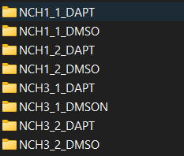
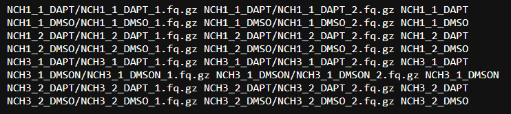
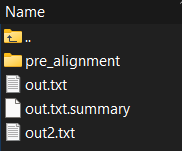
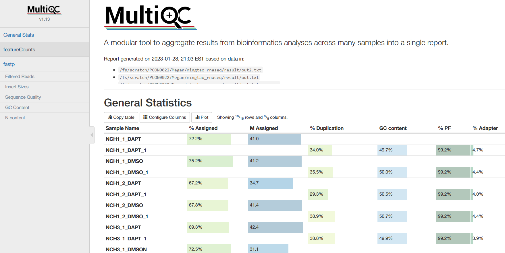

# What it does

This workflow provides a bulk RNA-seq reference path that starts with preprocessing on the OSC cluster and continues into downstream analysis in R. The materials cover fastq preparation, alignment and quantification submission, count-matrix preparation, PCA, differential expression, volcano plots, and enrichment analyses.

# When to use it

Use this workflow when you already have paired-end bulk RNA-seq data and want a lab-specific guide for moving from raw fastq files to count and metadata tables, then into downstream exploratory and differential expression analyses. It is most useful when you want example commands, expected intermediate files, and template code for common follow-up analysis decisions.

# Prerequisites

- Access to the workflow folder: [`_Archived/RNAseq_workflow`](https://github.com/OSU-BMBL/BMBL-analysis-notebooks/tree/master/_Archived/RNAseq_workflow)
- An OSC account and access to the project space described in the preprocessing tutorial
- R plus the packages listed in [`RNAseq_install_packages.R`](https://github.com/OSU-BMBL/BMBL-analysis-notebooks/blob/master/_Archived/RNAseq_workflow/RNAseq_install_packages.R)
- Example input tables from [`Example_Data`](https://github.com/OSU-BMBL/BMBL-analysis-notebooks/tree/master/_Archived/RNAseq_workflow/Example_Data)
- The main source files used by this page:
  - [`RNAseq_Preprocessing_Tutorial.md`](https://github.com/OSU-BMBL/BMBL-analysis-notebooks/blob/master/_Archived/RNAseq_workflow/RNAseq_Preprocessing_Tutorial.md)
  - [`RNAseq_Downstream_Analysis.md`](https://github.com/OSU-BMBL/BMBL-analysis-notebooks/blob/master/_Archived/RNAseq_workflow/RNAseq_Downstream_Analysis.md)
  - [`downstream_analysis_template.Rmd`](https://github.com/OSU-BMBL/BMBL-analysis-notebooks/blob/master/_Archived/RNAseq_workflow/downstream_analysis_template.Rmd)
  - [`downstream_analysis_template_using_limma.Rmd`](https://github.com/OSU-BMBL/BMBL-analysis-notebooks/blob/master/_Archived/RNAseq_workflow/downstream_analysis_template_using_limma.Rmd)
  - [`limma_deg.Rmd`](https://github.com/OSU-BMBL/BMBL-analysis-notebooks/blob/master/_Archived/RNAseq_workflow/limma_deg.Rmd)

# Steps

## Prepare OSC tools, references, and input data

The preprocessing tutorial assumes OSC access and uses shared lab paths for tools and reference genomes. Before submitting jobs, confirm the correct species reference and prepare your fastq files in sample-level folders.

```bash
/fs/ess/PCON0022/tools
/fs/ess/PCON0022/tools/genome/Mus_musculus.GRCm38.99
/fs/ess/PCON0022/tools/genome/Homo_sapiens.GRCh38.99
```

If you are using the provided example data, the tutorial points to the OSC copy and the local [`Example_Data`](https://github.com/OSU-BMBL/BMBL-analysis-notebooks/tree/master/_Archived/RNAseq_workflow/Example_Data) folder so you can compare expected inputs and outputs.

## Organize fastq files and generate `fastq_list.txt`

Each sample should be stored in its own folder, and the preprocessing scripts expect a `fastq_list.txt` with paired-end files and sample names. The provided helper script automates the list construction after you make the preprocessing scripts executable and load the expected OSC modules.

```bash
chmod +x *
module load gnu mkl R/4.0.2
Rscript build_fastq_list.R
```

::: {.grid}
::: {.g-col-12 .g-col-lg-6}

:::
::: {.g-col-12 .g-col-lg-6}

:::
:::

The relevant preprocessing files live under [`Preprocessing_code`](https://github.com/OSU-BMBL/BMBL-analysis-notebooks/tree/master/_Archived/RNAseq_workflow/Preprocessing_code):

- [`build_fastq_list.R`](https://github.com/OSU-BMBL/BMBL-analysis-notebooks/blob/master/_Archived/RNAseq_workflow/Preprocessing_code/build_fastq_list.R)
- [`run_primary_alignment.sh`](https://github.com/OSU-BMBL/BMBL-analysis-notebooks/blob/master/_Archived/RNAseq_workflow/Preprocessing_code/run_primary_alignment.sh)
- [`submit_primary_alignment.sh`](https://github.com/OSU-BMBL/BMBL-analysis-notebooks/blob/master/_Archived/RNAseq_workflow/Preprocessing_code/submit_primary_alignment.sh)
- [`run_quantification.sh`](https://github.com/OSU-BMBL/BMBL-analysis-notebooks/blob/master/_Archived/RNAseq_workflow/Preprocessing_code/run_quantification.sh)

## Submit alignment jobs

The alignment step uses `run_primary_alignment.sh` and expects you to set the working directory, reference genome, and an OSC Slurm header before submission. The tutorial gives this example header as a starting point:

```bash
#!/usr/bin/bash
#SBATCH --account PCON0022
#SBATCH --time=00:30:00
#SBATCH --nodes=1
#SBATCH --ntasks=8
#SBATCH --mem=32GB
```

After updating the script for your run, submit the alignment jobs from the correct working directory:

```bash
./submit_primary_alignment.sh
```

The tutorial notes that this step should produce `alignment_out`, `fastp_out`, and `result` directories, including `.bam`, `.sam`, `.sorted.bam`, and pre-alignment QC outputs.

## Run quantification and create analysis tables

Once alignment jobs finish, submit quantification and then convert the relevant output into `counts.csv` and `meta.csv`. The workflow suggests checking job completion first and then launching the quantification step.

```bash
squeue -u USERNAME
sbatch run_quantification.sh
```

After quantification, the guide expects you to download `out2.txt`, convert it into `counts.csv`, and build a matching `meta.csv` whose sample names align with the count-matrix columns. The example files in [`Example_Data`](https://github.com/OSU-BMBL/BMBL-analysis-notebooks/tree/master/_Archived/RNAseq_workflow/Example_Data) show the expected format.

## Optionally generate a MultiQC report

The preprocessing tutorial includes an optional MultiQC pass for summarizing QC outputs. It provides setup commands for a `multiqc` environment and a simple report-generation command from the results directory.

```bash
ml python
conda create -n multiqc python=3.8
source activate multiqc
pip install multiqc
multiqc *
```

::: {.grid}
::: {.g-col-12 .g-col-lg-6}

:::
::: {.g-col-12 .g-col-lg-6}

:::
:::

## Load counts, metadata, and required packages for downstream analysis

The downstream templates begin by installing or loading the required packages, reading `counts.csv` and `meta.csv`, removing duplicate gene rows, and filtering low-count genes. The package list in [`RNAseq_install_packages.R`](https://github.com/OSU-BMBL/BMBL-analysis-notebooks/blob/master/_Archived/RNAseq_workflow/RNAseq_install_packages.R) includes the core analysis stack used across the templates, including `DESeq2`, `limma`, `EnhancedVolcano`, `enrichR`, `fgsea`, and `msigdbr`.

```r
counts <- read.csv("./Example_Data/counts.csv")
meta <- read.csv("./Example_Data/meta.csv", stringsAsFactors = FALSE)
colnames(meta)[1] <- "sample_id"
colnames(meta)[2] <- "group"
keep <- rowSums(counts) >= 50
counts <- counts[keep, ]
```

The Markdown walkthrough calls out a few user-adjustable parameters at this stage, especially the low-count filtering threshold and datatable page length for metadata inspection.

## Choose a downstream analysis path and inspect PCA

The repository includes both a DESeq2-based template and a limma-based template. Both workflows use the same `counts.csv` and `meta.csv` handoff, but they differ in the modeling code used for differential expression.

For PCA, the downstream guide highlights that the grouping variable should be chosen intentionally based on the biological question, such as time, treatment, or the workflow's default `group` column.

```r
pcaData <- plotPCA(vsd, intgroup = c("time"), returnData = TRUE)
```

```r
pcaData <- plotPCA(vsd, intgroup = c("treatment"), returnData = TRUE)
```

## Define differential expression comparisons

The downstream workflow emphasizes that defining the comparison groups is one of the most important setup choices in the analysis. The DESeq2 template uses a contrast on the `group` variable, while the limma template builds a design matrix and contrast matrix from metadata levels.

```r
this_groups <- c("group_1", "group_2")
```

```r
res <- results(dds, contrast = c("group", "NCH3", "NCH1"))
write.csv(result, "./result/Group1_vs_Group2.csv")
```

```r
stopifnot(all(meta$sample_id == colnames(counts)))
contrast.matrix <- makeContrasts(
  paste0(levels(group)[1], "-", levels(group)[2]),
  levels = design
)
```

## Review volcano plots and enrichment results

For volcano plots, the tutorial shows example cutoffs for adjusted p-value and log2 fold change and notes that these should be adapted to the experiment. The downstream guide then moves into two enrichment patterns: over-representation analysis with `enrichR` and gene set enrichment analysis with `fgsea`.

```r
EnhancedVolcano(
  result,
  lab = rownames(result),
  x = "log2FoldChange",
  y = "padj",
  pCutoff = 0.05,
  FCcutoff = 1.5
)
```

```r
dbs <- c(
  "GO_Molecular_Function_2018",
  "GO_Cellular_Component_2018",
  "GO_Biological_Process_2018",
  "KEGG_2019_Human"
)
```

If the data are from mouse, the guide notes that the KEGG database entry should be switched to `KEGG_2019_Mouse`.

## Run fgsea with the appropriate database and permutation count

The fgsea section uses `msigdbr` or a saved qsave object to load gene sets, then runs `fgsea` with an explicit permutation count. The source templates show both GO Biological Process and KEGG-style examples for the enrichment stage.

```r
if (!file.exists("../all_gene_sets_human.qsave")) {
  all_gene_sets <- msigdbr(species = "human")
  qs::qsave(all_gene_sets, "all_gene_sets_human.qsave")
} else {
  all_gene_sets <- qs::qread("../all_gene_sets_human.qsave")
}
```

```r
fgseaRes <- fgsea(pathways = m_list, stats = res_gsea, nperm = 1000)
```

The main downstream source files for full code context are:

- [`RNAseq_Downstream_Analysis.md`](https://github.com/OSU-BMBL/BMBL-analysis-notebooks/blob/master/_Archived/RNAseq_workflow/RNAseq_Downstream_Analysis.md)
- [`downstream_analysis_template.Rmd`](https://github.com/OSU-BMBL/BMBL-analysis-notebooks/blob/master/_Archived/RNAseq_workflow/downstream_analysis_template.Rmd)
- [`downstream_analysis_template_using_limma.Rmd`](https://github.com/OSU-BMBL/BMBL-analysis-notebooks/blob/master/_Archived/RNAseq_workflow/downstream_analysis_template_using_limma.Rmd)
- [`limma_deg.Rmd`](https://github.com/OSU-BMBL/BMBL-analysis-notebooks/blob/master/_Archived/RNAseq_workflow/limma_deg.Rmd)

# Gotchas / notes

- This workflow assumes OSC-specific paths, module loads, and Slurm submission patterns, so cluster and filesystem details may need to be adapted for another environment.
- Make sure the species reference and downstream database choice match your dataset, especially for human-versus-mouse KEGG and gene-set resources.
- `counts.csv` and `meta.csv` need to stay aligned; sample identifiers in metadata should match the count-matrix columns before differential expression begins.
- The low-count filter (`keep`) is intentionally adjustable and should be tuned to the dataset rather than treated as a fixed universal threshold.
- PCA interpretation depends on the `intgroup` you choose, and the volcano plot cutoffs shown in the templates are example defaults rather than mandatory settings.
- In the limma template, the contrast matrix is derived from metadata levels, so confirm that factor levels and group ordering reflect the comparison you actually want.
- The number of permutations in `fgsea` is also a tuning decision; higher values can improve granularity at the cost of compute time.

# View source on GitHub

[📄 View source on GitHub](https://github.com/OSU-BMBL/BMBL-analysis-notebooks/tree/master/_Archived/RNAseq_workflow)
