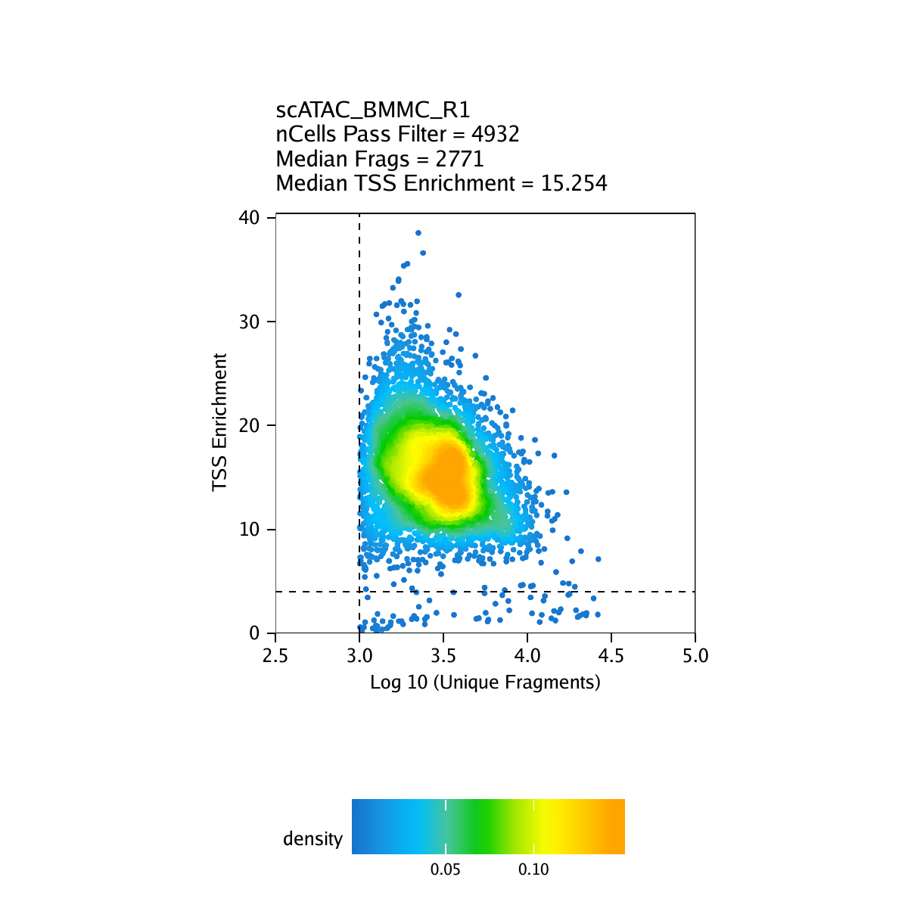
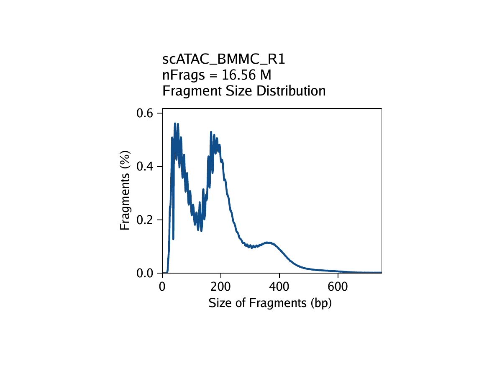
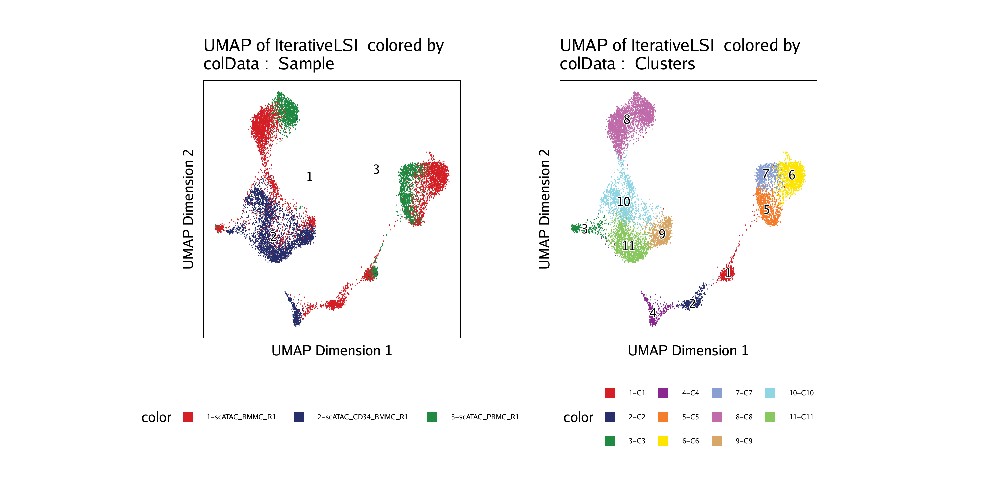
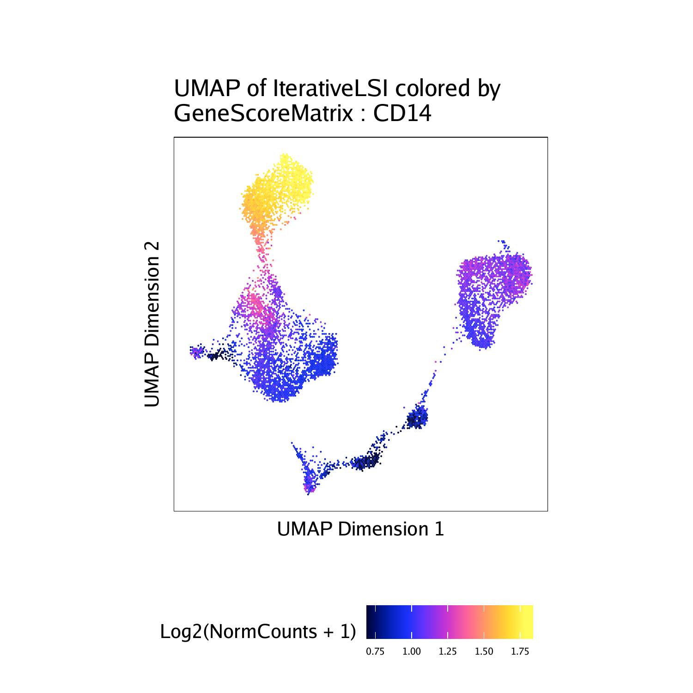
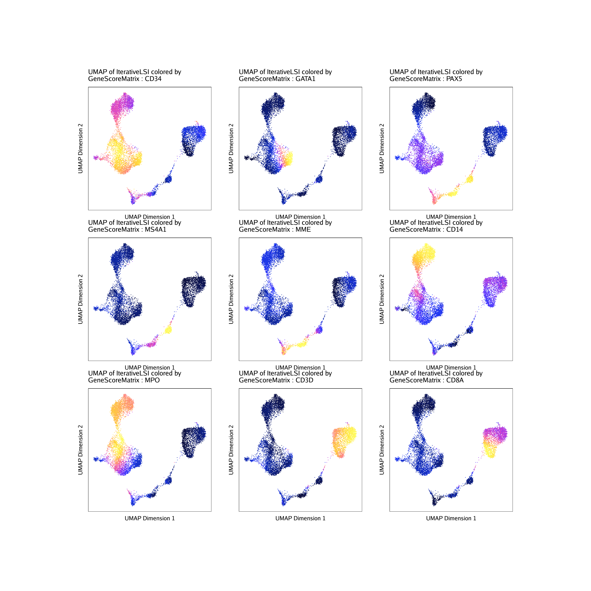
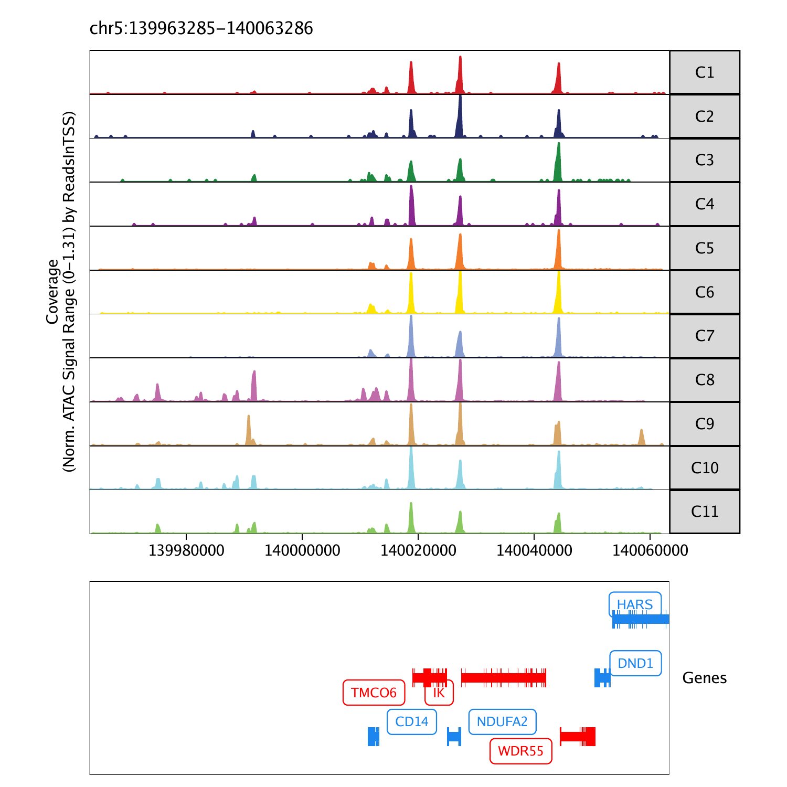

This is a ___brief___ ArchR tutorial. It does not showcase all of ArchR's functionality nor explain each of the steps in detail. Please see [the searchable full user's manual](bookdown/index.html) for an in-depth tutorial using real-world data and a full description of all aspects of ArchR analysis. 
<hr>

## Getting Set Up

First, we load the ArchR library. 

```{r setup, include=FALSE}
# Hide all warnings and messages, show code
knitr::opts_chunk$set(warning = FALSE)
knitr::opts_chunk$set(message = FALSE)
knitr::opts_chunk$set(echo = TRUE)

library(ArchR)
set.seed(1)

```


Next, we set the default number of threads for parallelized operations in ArchR functions. You should change the value passed to `threads` to match the specifications of your local machine. 

```{r eval=FALSE}
addArchRThreads(threads = 16) 
```

> \## Setting default number of Parallel threads to 16.
The Hematopoeisis tutorial data can be downloaded using the `getTutorialData()` function. The tutorial data is approximately 0.5 GB in size. If you have already downloaded the tutorial in the current working directory, ArchR will bypass downloading.

```{r eval=FALSE}
inputFiles <- getTutorialData("Hematopoiesis")
inputFiles
```

> \##                                       scATAC_BMMC_R1  
##      "HemeFragments/scATAC_BMMC_R1.fragments.tsv.gz"  
##                                  scATAC_CD34_BMMC_R1  
## "HemeFragments/scATAC_CD34_BMMC_R1.fragments.tsv.gz"  
##                                       scATAC_PBMC_R1  
##      "HemeFragments/scATAC_PBMC_R1.fragments.tsv.gz"  
Before we begin, we need add a reference genome annotation for ArchR to have access to chromosome and gene information. ArchR natively supports
hg19, hg38, mm9, and mm10.

```{r eval=FALSE}
addArchRGenome("hg19")
```

> \## Setting default genome to Hg19.
## Creating Arrow Files

Now we will create our Arrow files which will take 10-15 minutes. For each sample, this step will:

1. Read accessible fragments from the provided input files.
2. Calculate quality control information for each cell (i.e. TSS enrichment scores and nucleosome info).
3. Filter cells based on quality control parameters.
4. Create a genome-wide TileMatrix using 500-bp bins.
5. Create a GeneScoreMatrix using the custom `geneAnnotation` that was defined when we called `addArchRGenome()`.

```{r eval=FALSE}
ArrowFiles <- createArrowFiles(
  inputFiles = inputFiles,
  sampleNames = names(inputFiles),
  filterTSS = 4, #Dont set this too high because you can always increase later
  filterFrags = 1000, 
  addTileMat = TRUE,
  addGeneScoreMat = TRUE
)
```

> \## Using GeneAnnotation set by addArchRGenome(Hg19)!  
## Using GeneAnnotation set by addArchRGenome(Hg19)!  
## ArchR logging to : ArchRLogs/ArchR-createArrows-69ef6ba2e1c7-Date-2020-04-21_Time-16-18-35.log  
## If there is an issue, please report to github with logFile!  
## Cleaning Temporary Files  
## 2020-04-21 16:18:35 : Batch Execution w/ safelapply!, 0 mins elapsed.  
## ArchR logging successful to : ArchRLogs/ArchR-createArrows-69ef6ba2e1c7-Date-2020-04-21_Time-16-18-35.log  
We can inspect the `ArrowFiles` object to see that it is actually just a character vector of Arrow file paths.

```{r eval=FALSE}
ArrowFiles
```

> \## "scATAC_BMMC_R1.arrow"      "scATAC_CD34_BMMC_R1.arrow"  
## "scATAC_PBMC_R1.arrow"  
Strict quality control (QC) of scATAC-seq data is essential to remove the contribution of low-quality cells. In ArchR, we consider three characteristics of data:

1. The number of unique nuclear fragments (i.e. not mapping to mitochondrial DNA).
2. The signal-to-background ratio. Low signal-to-background ratio is often attributed to dead or dying cells which have de-chromatinzed DNA which allows for random transposition genome-wide.
3. The fragment size distribution. Due to nucleosomal periodicity, we expect to see depletion of fragments that are the length of DNA wrapped around a nucleosome (approximately 147 bp).

```{r, include=FALSE, eval=FALSE}
ArchR:::.convertToPNG()
system("cp Figures/*.png images/HemeShort/PNG/")
system("cp Figures/*.pdf images/HemeShort/PDF/")
```

For our tutorial data, an example of these QC plots is shown below for the __BMMC__ sample:

{width=330 height=330}
{width=430 height=330}

## Inferring Doublets

After Arrow file creation, we can infer potential doublets (a single droplet containing multiple cells) that can confound downstream results. This is done using the `addDoubletScores()` function.

```{r eval=FALSE}
doubScores <- addDoubletScores(
  input = ArrowFiles,
  k = 10, #Refers to how many cells near a "pseudo-doublet" to count.
  knnMethod = "UMAP", #Refers to the embedding to use for nearest neighbor search.
  LSIMethod = 1
)
```

```{r, include=FALSE, eval=FALSE}
ArchR:::.convertToPNG()
system("cp Figures/*.png images/HemeShort/PNG/")
system("cp Figures/*.pdf images/HemeShort/PDF/")
```

## Creating an `ArchRProject`

With our Arrow files in hand, we are now ready to create an `ArchRProject`. An `ArchRProject` is associated with a set of Arrow files and is the backbone of nearly all ArchR analyses.

```{r eval=FALSE}
proj <- ArchRProject(
  ArrowFiles = ArrowFiles, 
  outputDirectory = "HemeTutorial",
  copyArrows = TRUE #This is recommened so that you maintain an unaltered copy for later usage.
)
```

> \## Using GeneAnnotation set by addArchRGenome(Hg19)!  
## Using GeneAnnotation set by addArchRGenome(Hg19)!  
## Validating Arrows...  
## Getting SampleNames...  
##   
## Copying ArrowFiles to Ouptut Directory! If you want to save disk space set copyArrows = FALSE  
## 1 2 3   
## Getting Cell Metadata...   
##   
## Merging Cell Metadata...  
## Initializing ArchRProject...  
We can also ask which data matrices are available within the `ArchRProject` which will be useful downstream once we start adding to this project:

```{r eval=FALSE}
getAvailableMatrices(proj)
```

> \## [1] "GeneScoreMatrix" "TileMatrix"    
Now we can filter putative doublets based on the previously determined doublet scores using the `filterDoublets()` function. This doesn't physically remove data from the Arrow files but rather tells the `ArchRProject` to ignore these cells for downstream analysis.

```{r eval=FALSE}
proj <- filterDoublets(ArchRProj = proj)
```

> \## Filtering 410 cells from ArchRProject!  
##  scATAC_BMMC_R1 : 243 of 4932 (4.9%)  
##  scATAC_CD34_BMMC_R1 : 107 of 3275 (3.3%)  
##  scATAC_PBMC_R1 : 60 of 2454 (2.4%)  
## Dimensionality Reduction and Clustering

ArchR implements an iterative LSI dimensionality reduction via the `addIterativeLSI()` function.

```{r eval=FALSE}
proj <- addIterativeLSI(ArchRProj = proj, useMatrix = "TileMatrix", name = "IterativeLSI")
```

> \## Checking Inputs...  
## ArchR logging to : ArchRLogs/ArchR-addIterativeLSI-69ef14e7f129-Date-2020-04-21_Time-16-29-45.log  
## If there is an issue, please report to github with logFile!  
## 2020-04-21 16:29:46 : Computing Total Accessibility Across All Features, 0.005 mins elapsed.  
## 2020-04-21 16:29:49 : Computing Top Features, 0.068 mins elapsed.  
## ###########  
## 2020-04-21 16:29:50 : Running LSI (1 of 2) on Top Features, 0.077 mins elapsed.  
## ###########  
## 2020-04-21 16:29:50 : Sampling Cells (N = 10002) for Estimated LSI, 0.078 mins elapsed.  
## 2020-04-21 16:29:50 : Creating Sampled Partial Matrix, 0.078 mins elapsed.  
## 2020-04-21 16:29:58 : Computing Estimated LSI (projectAll = FALSE), 0.208 mins elapsed.  
## 2020-04-21 16:30:38 : Identifying Clusters, 0.876 mins elapsed.  
## 2020-04-21 16:31:00 : Identified 5 Clusters, 1.241 mins elapsed.  
## 2020-04-21 16:31:00 : Saving LSI Iteration, 1.242 mins elapsed.  
## 2020-04-21 16:31:21 : Creating Cluster Matrix on the total Group Features, 1.593 mins elapsed.  
## 2020-04-21 16:31:31 : Computing Variable Features, 1.759 mins elapsed.  
## ###########  
## 2020-04-21 16:31:31 : Running LSI (2 of 2) on Variable Features, 1.764 mins elapsed.  
## ###########  
## 2020-04-21 16:31:31 : Creating Partial Matrix, 1.764 mins elapsed.  
## 2020-04-21 16:31:40 : Computing LSI, 1.911 mins elapsed.  
## 2020-04-21 16:32:18 : Finished Running IterativeLSI, 2.541 mins elapsed.  
To call clusters in this reduced dimension sub-space, we use the `addClusters()` function which uses [Seurat's](https://satijalab.org/seurat/) graph clustering as the default clustering method.

```{r eval=FALSE}
proj <- addClusters(input = proj, reducedDims = "IterativeLSI")
```

> \## ArchR logging to : ArchRLogs/ArchR-addClusters-69ef73b1d963-Date-2020-04-21_Time-16-32-18.log  
## If there is an issue, please report to github with logFile!  
## 2020-04-21 16:32:19 : Running Seurats FindClusters (Stuart et al. Cell 2019), 0.004 mins elapsed.  
## Computing nearest neighbor graph  
## Computing SNN  
## Modularity Optimizer version 1.3.0 by Ludo Waltman and Nees Jan van Eck  
##   
## Number of nodes: 10251  
## Number of edges: 498555  
##   
## Running Louvain algorithm...  
## Maximum modularity in 10 random starts: 0.8575  
## Number of communities: 11  
## Elapsed time: 0 seconds  
## 2020-04-21 16:32:38 : Testing Outlier Clusters, 0.32 mins elapsed.  
## 2020-04-21 16:32:38 : Assigning Cluster Names to 11 Clusters, 0.32 mins elapsed.  
## 2020-04-21 16:32:38 : Finished addClusters, 0.322 mins elapsed.  
## Visualizing in a 2D UMAP Embedding

We can visualize our scATAC-seq data using a 2-dimensional representation such as Uniform Manifold Approximation and Projection (UMAP). To do this, we add a UMAP embedding to our `ArchRProject` object with the `addUMAP()` function. This function uses the [uwot package](https://github.com/jlmelville/uwot) to perform UMAP.

```{r eval=FALSE}
proj <- addUMAP(ArchRProj = proj, reducedDims = "IterativeLSI")
```

> \## 16:32:38 UMAP embedding parameters a = 0.7669 b = 1.223  
## 16:32:38 Read 10251 rows and found 30 numeric columns  
## 16:32:38 Using Annoy for neighbor search, n_neighbors = 40  
## 16:32:38 Building Annoy index with metric = cosine, n_trees = 50  
## 0%   10   20   30   40   50   60   70   80   90   100%  
## [----|----|----|----|----|----|----|----|----|----|  
## **************************************************|  
## 16:32:41 Writing NN index file to temp file /tmp/RtmpJ4Z9d9/file69ef223c61d2  
## 16:32:41 Searching Annoy index using 10 threads, search_k = 4000  
## 16:32:42 Annoy recall = 100%  
## 16:32:44 Commencing smooth kNN distance calibration using 10 threads  
## 16:32:45 Initializing from normalized Laplacian + noise  
## 16:32:46 Commencing optimization for 200 epochs, with 623598 positive edges  
## 16:32:58 Optimization finished  
Using this UMAP, we can visualize various attributes of our cells which are stored in a matrix called `cellColData` in our `ArchRProject`. To do this, we use the `plotEmbedding()` function and we specify the variable to use for coloration via a combination of the `colorBy` and `name` parameters.

For example, we can color by "Sample":

```{r eval=FALSE}
p1 <- plotEmbedding(ArchRProj = proj, colorBy = "cellColData", name = "Sample", embedding = "UMAP")
```

> \## ArchR logging to : ArchRLogs/ArchR-plotEmbedding-69ef25160449-Date-2020-04-21_Time-16-33-00.log  
## If there is an issue, please report to github with logFile!  
## Getting UMAP Embedding  
## ColorBy = cellColData  
## Plotting Embedding  
## 1   
## ArchR logging successful to : ArchRLogs/ArchR-plotEmbedding-69ef25160449-Date-2020-04-21_Time-16-33-00.log  
Or we can color by "Clusters":

```{r eval=FALSE}
p2 <- plotEmbedding(ArchRProj = proj, colorBy = "cellColData", name = "Clusters", embedding = "UMAP")
```

> \## ArchR logging to : ArchRLogs/ArchR-plotEmbedding-69ef420f8c0a-Date-2020-04-21_Time-16-33-01.log  
## If there is an issue, please report to github with logFile!  
## Getting UMAP Embedding  
## ColorBy = cellColData  
## Plotting Embedding  
## 1   
## ArchR logging successful to : ArchRLogs/ArchR-plotEmbedding-69ef420f8c0a-Date-2020-04-21_Time-16-33-01.log   

```{r eval=FALSE}
ggAlignPlots(p1, p2, type = "h")
```

```{r, include=FALSE, eval=FALSE}
plotPDF(
    ggAlignPlots(p1, p2, type = "h", draw=FALSE), 
    name = "Plot-UMAP-Sample-Clusters-Combined.pdf", 
    ArchRProj = proj,
    addDOC = FALSE,
    width = 10, 
    height = 5
)
ArchR:::.convertToPNG(ArchRProj = proj)
system("cp Figures/*.png images/HemeShort/PNG/")
system("cp Figures/*.pdf images/HemeShort/PDF/")
```

{width=900}

To save an editable vectorized version of this plot, we use the `plotPDF()` function.

```{r eval=FALSE}
plotPDF(p1,p2, name = "Plot-UMAP-Sample-Clusters.pdf",
        ArchRProj = proj, addDOC = FALSE, width = 5, height = 5)
```

> \## [1] "plotting ggplot!"  
## [1] "plotting ggplot!"  
## [1] 0  
[Download PDF : Plot-UMAP-Sample-Clusters.pdf](../../images/HemeShort/PDF/Plot-UMAP-Sample-Clusters.pdf)

## Assigning Clusters with Gene Scores

We can try to assign biological labels to these clusters using marker genes of known hematopoietic regulators. First, we add imputation weights using [MAGIC](https://github.com/KrishnaswamyLab/MAGIC) to help smooth the dropout noise in our gene scores.

```{r eval=FALSE}
proj <- addImputeWeights(proj)
```

> \## ArchR logging to : ArchRLogs/ArchR-addImputeWeights-69ef433c71d0-Date-2020-04-21_Time-16-33-19.log  
## If there is an issue, please report to github with logFile!  
## 2020-04-21 16:33:19 : Computing Impute Weights Using Magic (Cell 2018), 0 mins elapsed.  
Now we can overlay our marker gene scores on our 2D UMAP embedding.

```{r eval=FALSE}
markerGenes  <- c(
    "CD34",  #Early Progenitor
    "GATA1", #Erythroid
    "PAX5", "MS4A1", "MME", #B-Cell Trajectory
    "CD14", "MPO", #Monocytes
    "CD3D", "CD8A"#TCells
  )
p <- plotEmbedding(
    ArchRProj = proj, 
    colorBy = "GeneScoreMatrix", 
    name = markerGenes, 
    embedding = "UMAP",
    imputeWeights = getImputeWeights(proj)
)

```

> \## Getting ImputeWeights  
## ArchR logging to : ArchRLogs/ArchR-plotEmbedding-69ef2f10a62d-Date-2020-04-21_Time-16-33-31.log  
## If there is an issue, please report to github with logFile!  
## Getting UMAP Embedding  
## ColorBy = GeneScoreMatrix  
## Getting Matrix Values...  
## 2020-04-21 16:33:32 :  
##   
## Imputing Matrix  
## Using weights on disk  
## Using weights on disk  
## Plotting Embedding  
## 1 2 3 4 5 6 7 8 9   
## ArchR logging successful to : ArchRLogs/ArchR-plotEmbedding-69ef2f10a62d-Date-2020-04-21_Time-16-33-31.log  
To plot a specific gene we can subset this plot list using the gene name.

```{r, eval=FALSE}
p$CD14
```

<center>
{width=500 height=500}
</center>

To plot all genes we can use `cowplot` to arrange the 9 different plots together. Each of these marker genes lights up the corresponding cell clusters. For example, we infer that the cells that have the highest gene score for CD3D, a known T cell marker, are in fact T cells.

```{r, eval=FALSE}
#Rearrange for grid plotting
p2 <- lapply(p, function(x){
    x + guides(color = FALSE, fill = FALSE) + 
    theme_ArchR(baseSize = 6.5) +
    theme(plot.margin = unit(c(0, 0, 0, 0), "cm")) +
    theme(
        axis.text.x=element_blank(), 
        axis.ticks.x=element_blank(), 
        axis.text.y=element_blank(), 
        axis.ticks.y=element_blank()
    )
})
do.call(cowplot::plot_grid, c(list(ncol = 3),p2))
```

```{r, include=FALSE, eval=FALSE}
plotPDF(
    do.call(cowplot::plot_grid, c(list(ncol = 3),p2)), 
    name = "Plot-UMAP-Markers-W-Imputation.pdf", 
    ArchRProj = proj,
    addDOC = FALSE,
    width = 10, 
    height = 10
)
ArchR:::.convertToPNG(ArchRProj = proj)
system("cp Figures/*.png images/HemeShort/PNG/")
system("cp Figures/*.pdf images/HemeShort/PDF/")
```

<center>
{width=900 height=900}
</center>

To save an editable vectorized version of this plot, we use the `plotPDF()` function.

```{r eval=FALSE}
plotPDF(plotList = p, 
    name = "Plot-UMAP-Marker-Genes-W-Imputation.pdf", 
    ArchRProj = proj, 
    addDOC = FALSE, width = 5, height = 5)
```
> \## [1] "plotting ggplot!"  
## [1] "plotting ggplot!"  
## [1] "plotting ggplot!"  
## [1] "plotting ggplot!"  
## [1] "plotting ggplot!"  
## [1] "plotting ggplot!"  
## [1] "plotting ggplot!"  
## [1] "plotting ggplot!"  
## [1] "plotting ggplot!"  
## [1] 0  
[Download PDF : Plot-UMAP-Marker-Genes-W-Imputation.pdf](../../images/HemeShort/PDF/Plot-UMAP-Marker-Genes-W-Imputation.pdf)

## Visualizing Genome Browser Tracks

In addition to plotting gene scores per cell as a UMAP overlay, we can browse the local chromatin accessibility at these marker genes on a per cluster basis with genome browser tracks. To do this, we use the `plotBrowserTrack()` function which will create a list of plots, one for each of the genes specified by `markerGenes`.

```{r eval=FALSE}
p <- plotBrowserTrack(
    ArchRProj = proj, 
    groupBy = "Clusters", 
    geneSymbol = markerGenes, 
    upstream = 50000,
    downstream = 50000
)
```
> \## ArchR logging to : ArchRLogs/ArchR-plotBrowserTrack-69ef1ca18f89-Date-2020-04-21_Time-16-34-17.log  
## If there is an issue, please report to github with logFile!  
## 2020-04-21 16:34:17 : Validating Region, 0.006 mins elapsed.  
## GRanges object with 9 ranges and 2 metadata columns:  
##       seqnames              ranges strand |     gene_id      symbol  
##          <Rle>           <IRanges>  <Rle> | <character> <character>  
##   [1]     chr1 208059883-208084683      - |         947        CD34  
##   [2]     chrX   48644982-48652717      + |        2623       GATA1  
##   [3]     chr9   36838531-37034476      - |        5079        PAX5  
##   [4]    chr11   60223282-60238225      + |         931       MS4A1  
##   [5]     chr3 154741913-154901518      + |        4311         MME  
##   [6]     chr5 140011313-140013286      - |         929        CD14  
##   [7]    chr17   56347217-56358296      - |        4353         MPO  
##   [8]    chr11 118209789-118213459      - |         915        CD3D  
##   [9]     chr2   87011728-87035519      - |         925        CD8A  
##   -------  
##   seqinfo: 24 sequences from hg19 genome  
## 2020-04-21 16:34:17 : Adding Bulk Tracks (1 of 9), 0.007 mins elapsed.  
## 2020-04-21 16:34:19 : Adding Gene Tracks (1 of 9), 0.033 mins elapsed.  
## 2020-04-21 16:34:19 : Plotting, 0.043 mins elapsed.  
## 2020-04-21 16:34:22 : Adding Bulk Tracks (2 of 9), 0.084 mins elapsed.  
## 2020-04-21 16:34:22 : Adding Gene Tracks (2 of 9), 0.099 mins elapsed.  
## 2020-04-21 16:34:23 : Plotting, 0.105 mins elapsed.  
## 2020-04-21 16:34:26 : Adding Bulk Tracks (3 of 9), 0.156 mins elapsed.  
## 2020-04-21 16:34:27 : Adding Gene Tracks (3 of 9), 0.174 mins elapsed.  
## 2020-04-21 16:34:27 : Plotting, 0.182 mins elapsed.  
## 2020-04-21 16:34:30 : Adding Bulk Tracks (4 of 9), 0.219 mins elapsed.  
## 2020-04-21 16:34:31 : Adding Gene Tracks (4 of 9), 0.235 mins elapsed.  
## 2020-04-21 16:34:31 : Plotting, 0.242 mins elapsed.  
## 2020-04-21 16:34:32 : Adding Bulk Tracks (5 of 9), 0.265 mins elapsed.  
## 2020-04-21 16:34:34 : Adding Gene Tracks (5 of 9), 0.284 mins elapsed.  
## 2020-04-21 16:34:34 : Plotting, 0.291 mins elapsed.  
## 2020-04-21 16:34:36 : Adding Bulk Tracks (6 of 9), 0.318 mins elapsed.  
## 2020-04-21 16:34:37 : Adding Gene Tracks (6 of 9), 0.334 mins elapsed.  
## 2020-04-21 16:34:37 : Plotting, 0.339 mins elapsed.  
## 2020-04-21 16:34:39 : Adding Bulk Tracks (7 of 9), 0.374 mins elapsed.  
## 2020-04-21 16:34:40 : Adding Gene Tracks (7 of 9), 0.391 mins elapsed.  
## 2020-04-21 16:34:41 : Plotting, 0.401 mins elapsed.  
## 2020-04-21 16:34:44 : Adding Bulk Tracks (8 of 9), 0.454 mins elapsed.  
## 2020-04-21 16:34:45 : Adding Gene Tracks (8 of 9), 0.473 mins elapsed.  
## 2020-04-21 16:34:45 : Plotting, 0.482 mins elapsed.  
## 2020-04-21 16:34:47 : Adding Bulk Tracks (9 of 9), 0.515 mins elapsed.  
## 2020-04-21 16:34:49 : Adding Gene Tracks (9 of 9), 0.537 mins elapsed.  
## 2020-04-21 16:34:49 : Plotting, 0.546 mins elapsed.  
## ArchR logging successful to : ArchRLogs/ArchR-plotBrowserTrack-69ef1ca18f89-Date-2020-04-21_Time-16-34-17.log  
To plot a track of a specific gene, we can simply select one from the list.

```{r eval=FALSE}
grid::grid.newpage()
grid::grid.draw(p$CD14)
```

```{r, include=FALSE, eval=FALSE}
plotPDF(plotList = p, 
    name = "Plot-Tracks-Marker-Genes.pdf", 
    ArchRProj = proj, 
    addDOC = FALSE, 
    width = 5, 
    height = 5
)
ArchR:::.convertToPNG(ArchRProj = proj)
system("cp Figures/*.png images/HemeShort/PNG/")
system("cp Figures/*.pdf images/HemeShort/PDF/")
```
<center>
{width=700}
</center>

We can save a multi-page PDF with a single page for each gene locus in our plot list using the `plotPDF()` function.

```{r eval=FALSE}
plotPDF(plotList = p, 
    name = "Plot-Tracks-Marker-Genes.pdf", 
    ArchRProj = proj, 
    addDOC = FALSE, width = 5, height = 5)
```
> \## NULL   
## NULL  
## NULL  
## NULL  
## NULL  
## NULL  
## NULL  
## NULL  
## NULL  
## [1] 0  
[Download PDF : Plot-Tracks-Marker-Genes.pdf](../../images/HemeShort/PDF/Plot-Tracks-Marker-Genes.pdf)

Last but certainly not least, ArchR natively supports an interactive and dynamic genome browser that can be launched locally via a [shiny app](https://shiny.rstudio.com/). To do this, we use the `ArchRBrowser()` function.

```{r eval=FALSE}
ArchRBrowser(ArchRProj = proj)
```
This launches a dynamic genome browser session with a whole host of features including export of vectorized tracks for publication.

## Saving and Loading an `ArchRProject`

To easily save an `ArchRProject` for later use or for sharing with collaborators, we use the `saveArchRProject()` function. This copies the current `ArchRProject` object and all of the Arrow files to a specified directory. If we don't specify an output directory (as below), `saveArchRProject()` uses the output directory that we specified upon creation of our `ArchRProject`. In this case that is the folder "HemeTutorial".

```{r eval=FALSE}
proj <- saveArchRProject(ArchRProj = proj)
```
> \## Saving ArchRProject...  
## Loading ArchRProject...  
## Successfully loaded ArchRProject!  
When we are ready to load this saved `ArchRProject` we use the `loadArchRProject()` object and provide the path to the folder containing the saved `ArchRProject` object.
```{r eval=FALSE}
proj <- loadArchRProject(path = "HemeTutorial")
```
> \## Successfully loaded ArchRProject!
# Session Infomation

```{r, echo=T,eval=T,message=F,warning=F,error=T}
sessionInfo()
```

---
*The lesson material was originally created by Harvard Chan Bioinformatics Core, and has been developed by members of the BMBL.*
