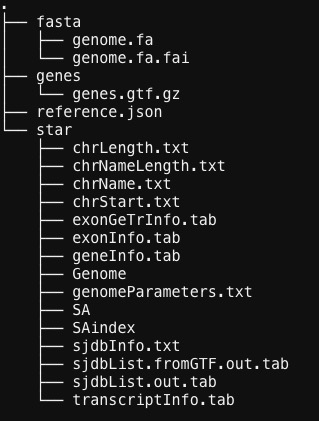
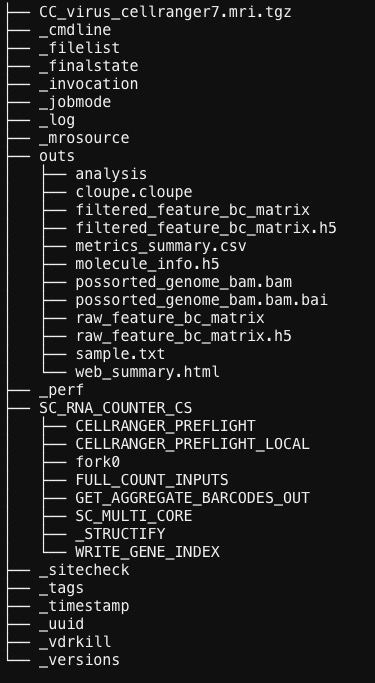
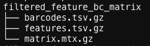

# HPV mapping Tutorial
This tutorial is to detect and identify HPV from single-cell RNA-sequencing (scRNA-seq) raw data based on CellRanger.

## Install CellRanger 
The first step is to install lateset [Cell Ranger](https://support.10xgenomics.com/single-cell-gene-expression/software/downloads/latest). Once the tar.gz file is downloaded in wanted directory, type the folloiwng in the terminal to decompress into current directory.

```
cd /fs/ess/PCON0022/tools
tar -xzvf cellranger-7.1.0.tar.gz
```

## Data preparation 
Several data should be prepared:
1. Host scRNA-seq raw data in .fastq (one sample in one folder)
2. HPV complete genome in .fna 
3. HPV annotation file in .gft

Please note that there are dozens or hundreds types for HPV. Make sure the complete genome is the right one you need. 

In this example, we are using HPV type 16 downaloded from [NIBI database](https://www.ncbi.nlm.nih.gov/assembly/). When asking "select file source", select RefSeq or GenBank whichever is avaibale. [ViruSite](http://www.virusite.org/index.php?nav=search) is a genome reference database which is able to select multiple micriobiome genome and download as one file. 

## Create HPV genome reference 
Once we have virus genome and annotation files, we will use them to generate a HPV genome reference file based on CellRanger. Before we run the code, we need to manually make some changes in the .gft file as virus sequenceing does not contain "exon" column. Please do the following in the .gft file: **Change the third column "CDS" into "exon".**

The HPV reference genome and can now be built by typing:

```
tools=/fs/ess/PCON0022/tools
cd /fs/ess/PCON0022
$tools/cellranger-7.1.0/cellranger mkref \
          --genome=hpv_ref_genome \
          --fasta=path/to/hpv.fna \
          --genes=path/to/hpv.gtf
```

The output files in the folder "hpv_ref_genome" include the following:


## Set Cell Ranger parameters
Parameters in the Cell Ranger can be modifed based on your need. In this case, we set the parameters as follow:
1. Find a file named "cellranger-7.1.0/lib/bin/parameters.toml".
2. Change the third row in this file into "star_parameters = "--alignIntronMax 1 --genomeSAindexNbases 6"

## Mapping HPV in scRNA-data
We can now get the viral gene expression matrix by using CellRanger count function. Typing the following:

```
wd=path/to/where/to/save/output
CellRanger=/fs/ess/PCON0022/tools/cellranger-7.1.0-virus/cellranger
FastqFolder=path/to/host/fastq/
Refer=/fs/ess/PCON0022/hpv_ref_genome
cd $wd
${CellRanger} count --id=hpv_mapping_output --transcriptome=${Refer} --fastqs=${FastqFolder} --sample=CC --chemistry=SC3P_auto --localcores=8  --localmem=64
```
Please note that in the "--sample", the sample name has to be exactly the same as the prefix name in the scRNA-seq raw fastq file. In this case, the scRNA-seq raw fastq file is called "	CC_S1_L001_R1_001.fastq.gz", so we have "--sample=CC". 

The file we submit for mapping is also attached as "cc_hpv_mapping.sh". 

## Virus gene expression matrix
We can go to folder "hpv_mapping_output" we created for saving the output in the above step. Folder "hpv_mapping_output" shall contain the following files:


The gene expression matrix to be used for the further analysis in R or python can be found under folder "outs". For example, we use matrix under the folder "filtered_feature_bc_matrix":



