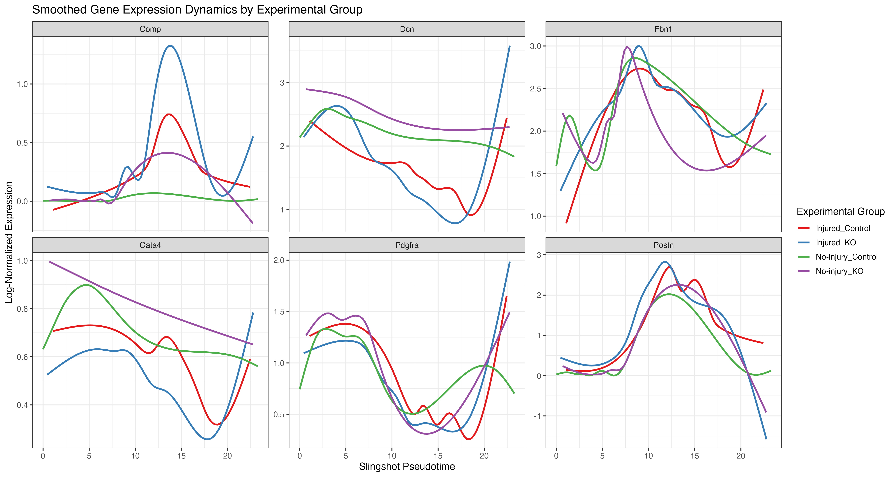

# Slingshot Trajectory Analysis for scRNAseq Data

**Author**: Cankun Wang
**Date**: January 2026

This workflow performs trajectory analysis on single-cell RNA sequencing data using the Slingshot package in R. It includes cell type proportion analysis, trajectory inference, pseudotime visualization, and smoothed gene expression dynamics.



## Features

- **Cell type proportion analysis** with `speckle` for comparing group compositions
- **Slingshot trajectory inference** with visualization of lineages
- **Pseudotime distribution plots** (density, violin) across experimental groups
- **Smoothed gene expression dynamics** along pseudotime (GAM smoothing)
- **Pseudotime heatmaps** for visualizing gene expression patterns

## Input

Before you proceed, ensure you have:

- A pre-analyzed scRNAseq Seurat object (.rds or .qsave) with:
  - Normalized expression data (run `NormalizeData()` if not done)
  - Cell type annotations
  - Experimental group metadata
  - Dimensional reduction (UMAP/PCA)

## Output

Results are saved to the `./figures/` directory:

- Cell type proportion statistics (CSV)
- UMAP visualizations colored by cluster, group, and pseudotime (PNG)
- Pseudotime distribution plots (density, violin)
- Smoothed gene expression dynamics plots
- Pseudotime heatmap
- Pseudotime values per cell (CSV)

## Directory Structure

```
scRNAseq_trajectory_Slingshot/
├── README.md                           # This file
├── 0_install_packages.R                # Package installation
├── 1_trajectory_slingshot.rmd          # Main trajectory analysis
├── 2_pseudotime_gene_dynamics.R        # Gene dynamics visualization
├── figures/                            # Output directory
│   └── example_plot.png                # Example output
└── data/                               # Input data (user-provided)
```

## Prerequisites

Install required packages by running:

```bash
Rscript 0_install_packages.R
```

Or manually install:

```r
# CRAN packages
install.packages(c("Seurat", "SeuratObject", "qs", "tidyverse", "ggplot2",
                   "patchwork", "RColorBrewer", "viridis", "pheatmap", "here"))

# Bioconductor packages
if (!requireNamespace("BiocManager", quietly = TRUE))
    install.packages("BiocManager")
BiocManager::install(c("slingshot", "SingleCellExperiment",
                       "tradeSeq", "BiocParallel", "speckle"))
```

## Running the Workflow

### Step 1: Install packages

```bash
Rscript 0_install_packages.R
```

### Step 2: Run trajectory analysis

Open `1_trajectory_slingshot.rmd` in RStudio and modify the USER PARAMETERS section:

| Parameter | Description | Example |
|-----------|-------------|---------|
| `DATA_PATH` | Path to your Seurat object | `"your_seurat.rds"` |
| `CELL_TYPE_COL` | Cell type metadata column | `"cell_type"` |
| `CELL_TYPES_TO_USE` | Cell types to include | `c("Fibroblasts", "Myofibroblasts")` |
| `start_cluster` | Starting cluster for trajectory | `"6"` |

Then knit the R Markdown file or run chunks interactively.

### Step 3: Generate gene dynamics plots (optional)

Run `2_pseudotime_gene_dynamics.R` as a standalone script:

```r
# Edit USER PARAMETERS section:
SEURAT_PATH <- "your_seurat.rds"
GROUP_COL <- "group"
GENES_TO_PLOT <- c("Col1a1", "Fn1", "Acta2")

# Then run:
source("2_pseudotime_gene_dynamics.R")
```

## Troubleshooting

### Gene not found
- Check gene names match your data: `rownames(sobj)[grep("Col1a", rownames(sobj), ignore.case=TRUE)]`
- Mouse genes are sentence case (Col1a1), human are uppercase (COL1A1)

### Pseudotime looks wrong
- Try different `start.clus` in Slingshot (the starting cluster)
- Check UMAP - trajectory should follow biological progression

### Groups not showing
- Verify column name: `colnames(sobj@meta.data)`
- Check for NA values: `table(sobj$group, useNA = "always")`

## Contact

Author: Cankun Wang (wang.13246@osu.edu)

## Methods for Manuscript

Please revise the example bioinformatics methods based on your settings:

> To analyze the cell trajectory during the differentiation of XXX cell types, we employed the Slingshot method (v.2.8.0), which infers cell lineages and estimates expression dynamics across lineages over pseudotime. The Seurat object was first converted into a SingleCellExperiment format using the as.SingleCellExperiment() function. Trajectory inference was then performed using Slingshot with its default settings, applied to the UMAP embeddings for dimensionality reduction. The predefined starting points for the trajectory were set as the XXXX cell types. Pseudotime values were estimated to track the progression of cells along these developmental lineages, providing insights into the temporal expression changes during differentiation.

Citation: https://bmcgenomics.biomedcentral.com/articles/10.1186/s12864-018-4772-0

## Session Info as Tested

```
> sessionInfo()
R version 4.4.0 (2024-04-24)
Platform: x86_64-pc-linux-gnu
Running under: Red Hat Enterprise Linux 9.4 (Plow)

Matrix products: default
BLAS/LAPACK: /apps/spack/0.21/ascend/linux-rhel9-zen2/intel-oneapi-mkl/gcc/11.4.1/2023.2.0-gwnin2p/mkl/2023.2.0/lib/intel64/libmkl_gf_lp64.so.2;  LAPACK version 3.10.1

locale:
 [1] LC_CTYPE=en_US.UTF-8       LC_NUMERIC=C               LC_TIME=en_US.UTF-8        LC_COLLATE=en_US.UTF-8     LC_MONETARY=en_US.UTF-8
 [6] LC_MESSAGES=en_US.UTF-8    LC_PAPER=en_US.UTF-8       LC_NAME=C                  LC_ADDRESS=C               LC_TELEPHONE=C
[11] LC_MEASUREMENT=en_US.UTF-8 LC_IDENTIFICATION=C

time zone: US/Eastern
tzcode source: internal

attached base packages:
[1] stats4    stats     graphics  grDevices utils     datasets  methods   base

other attached packages:
 [1] DelayedMatrixStats_1.28.1   DelayedArray_0.32.0         SparseArray_1.6.2           S4Arrays_1.6.0
 [5] abind_1.4-8                 Matrix_1.7-3                RColorBrewer_1.1-3          MoMAColors_0.0.0.9000
 [9] data.table_1.17.4           slingshot_2.14.0            TrajectoryUtils_1.14.0      princurve_2.1.6
[13] lubridate_1.9.4             forcats_1.0.0               stringr_1.5.1               dplyr_1.1.4
[17] purrr_1.0.4                 readr_2.1.5                 tidyr_1.3.1                 tibble_3.3.0
[21] tidyverse_2.0.0             qs_0.27.3                   here_1.0.1                  patchwork_1.3.0
[25] cowplot_1.1.3               Seurat_5.3.0                SeuratObject_5.1.0          sp_2.2-0
[29] SingleCellExperiment_1.28.1 SummarizedExperiment_1.36.0 Biobase_2.66.0              GenomicRanges_1.58.0
[33] GenomeInfoDb_1.42.3         IRanges_2.40.1              S4Vectors_0.44.0            BiocGenerics_0.52.0
[37] MatrixGenerics_1.18.1       matrixStats_1.5.0           ggthemes_5.1.0              ggbeeswarm_0.7.2
[41] ggplot2_3.5.2               Polychrome_1.5.4
```
