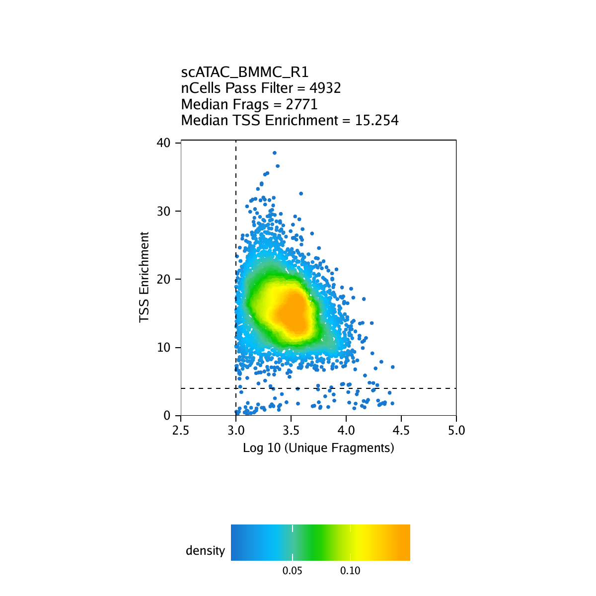
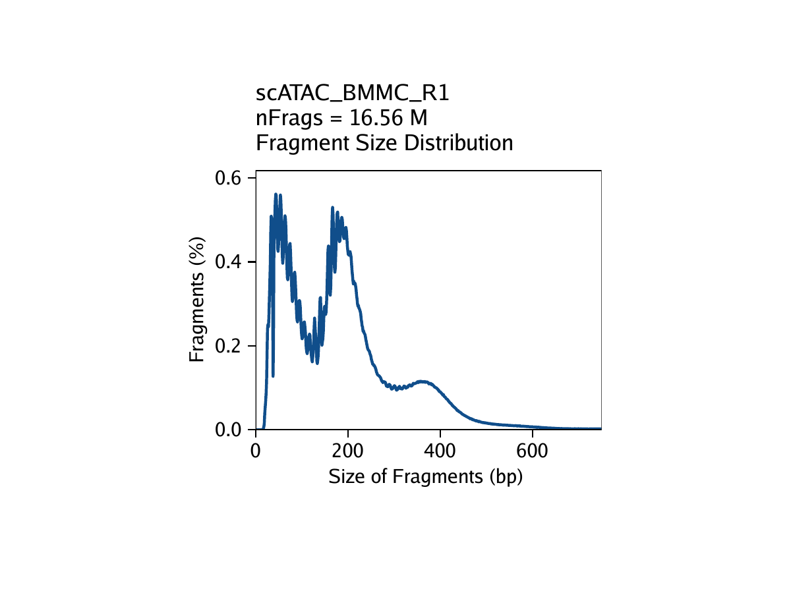
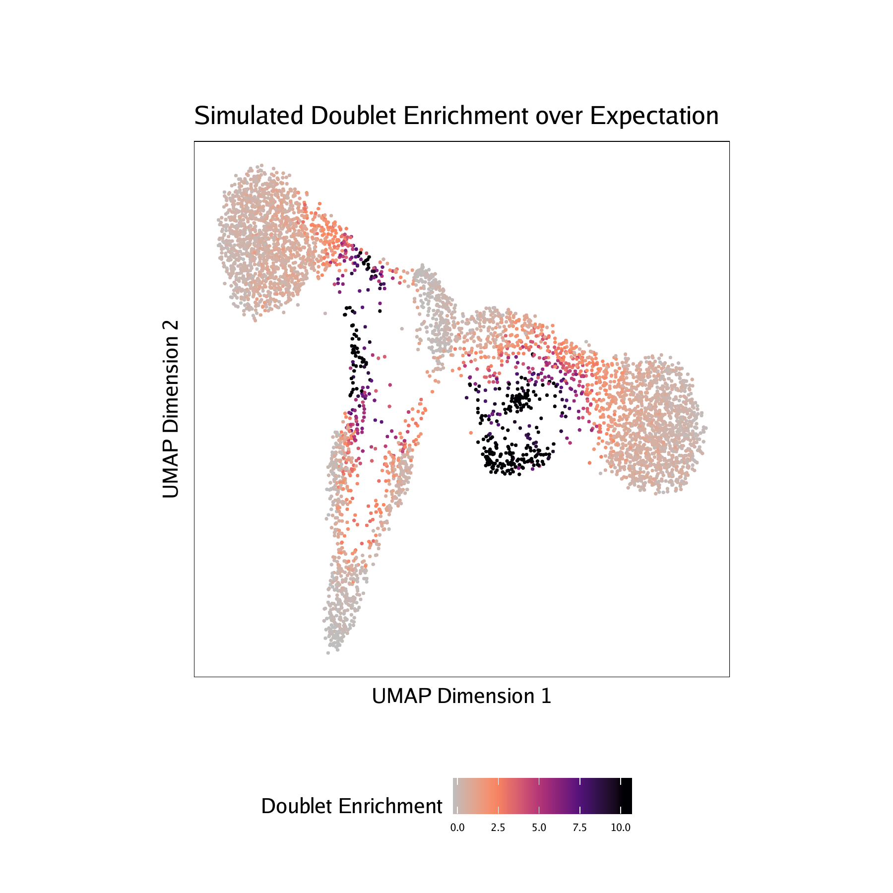
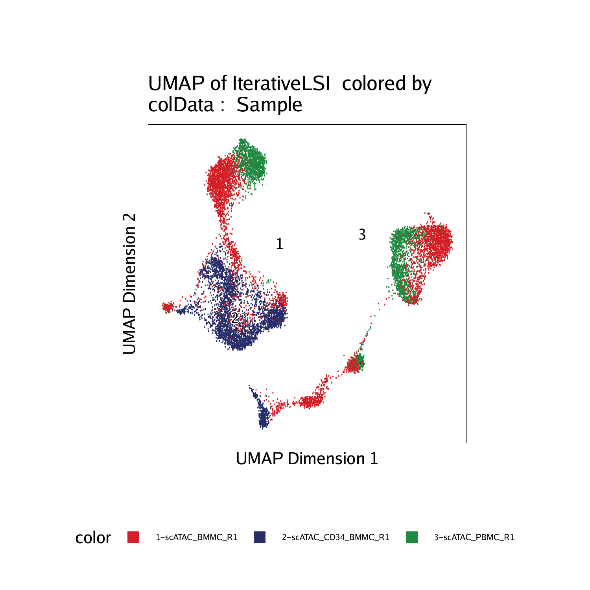
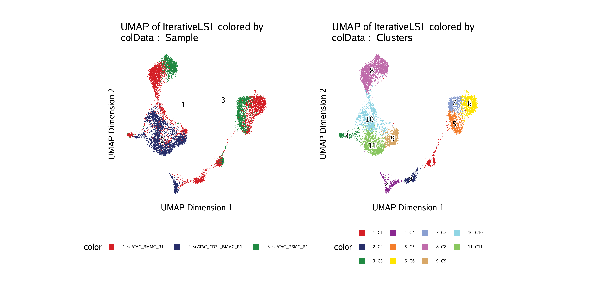
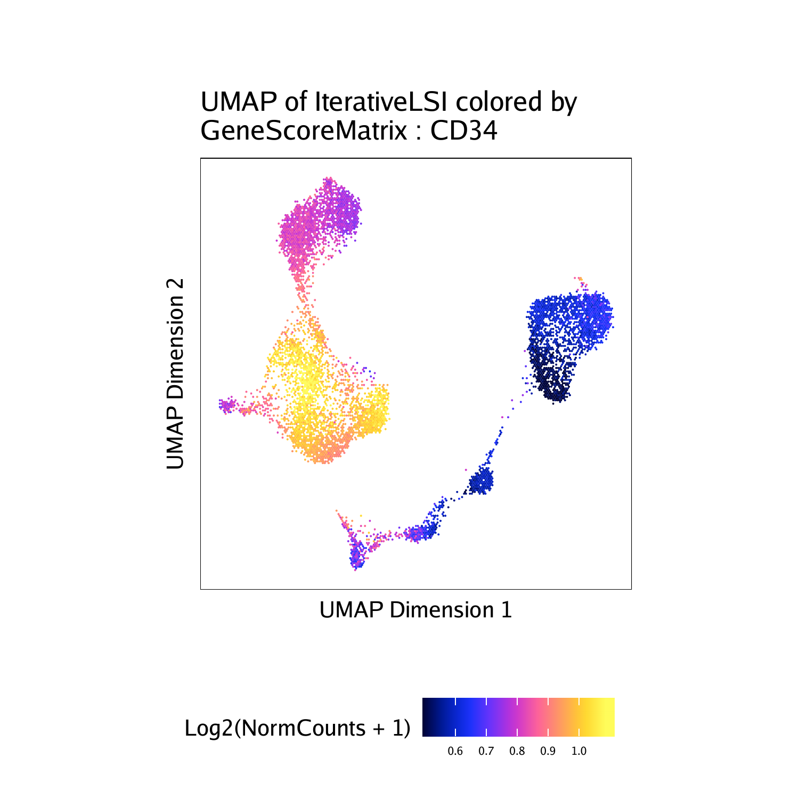
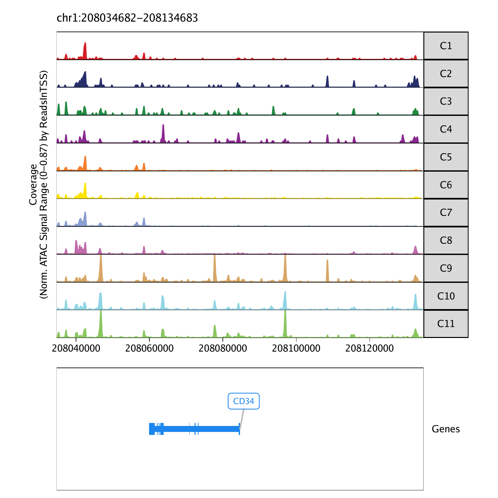

## What it does

This workflow uses ArchR to analyze single-cell ATAC-seq data from fragment files through dimensional reduction and visualization. The committed materials cover Arrow file creation, doublet detection, iterative LSI, clustering, UMAP visualization, gene-score inspection, and genome browser track generation.

## When to use it

Use this workflow when you want an ArchR-native path instead of a Signac-based one, especially for fragment-heavy preprocessing, Arrow file management, and browser-style track visualization. It is strongest as a reference for multi-sample scATAC-seq projects that need ArchR's project structure and QC tooling.

## Prerequisites

- Source folder: [`scATACseq_ArchR_branch`](https://github.com/OSU-BMBL/BMBL-analysis-notebooks/tree/master/scATACseq_ArchR_branch)
- Main files:
  - [`README.md`](https://github.com/OSU-BMBL/BMBL-analysis-notebooks/blob/master/scATACseq_ArchR_branch/README.md)
  - [`ArchR_tutorial.rmd`](https://github.com/OSU-BMBL/BMBL-analysis-notebooks/blob/master/scATACseq_ArchR_branch/ArchR_tutorial.rmd)
  - rendered reference: [`ArchR_tutorial.html`](https://github.com/OSU-BMBL/BMBL-analysis-notebooks/blob/master/scATACseq_ArchR_branch/ArchR_tutorial.html)
- Committed figure assets in [`scATACseq_ArchR_branch/images`](https://github.com/OSU-BMBL/BMBL-analysis-notebooks/tree/master/scATACseq_ArchR_branch/images)
- Package stack centered on `ArchR`

## Steps

### Set up the ArchR environment and tutorial inputs

The notebook begins by loading ArchR, setting thread counts, choosing a genome build, and downloading or locating tutorial fragment inputs. It also logs the session so the analysis state can be traced across longer runs.

```r
library(ArchR)
addArchRThreads(threads = 4)
addArchRGenome("hg38")
```

### Create Arrow files and inspect QC metrics

ArchR's first major step is `createArrowFiles()`, which builds Arrow files from fragment inputs while calculating quality metrics such as TSS enrichment and fragment counts.

```r
ArrowFiles <- createArrowFiles(
  inputFiles = input_files,
  sampleNames = sample_names,
  minTSS = 4,
  minFrags = 1000,
  addTileMat = TRUE,
  addGeneScoreMat = TRUE
)
```

The committed image set includes the QC-style outputs used in this stage.

::: {.grid}
::: {.g-col-12 .g-col-lg-6}

:::
::: {.g-col-12 .g-col-lg-6}

:::
:::

### Detect doublets and build the `ArchRProject`

The next stage adds doublet scores and then creates the main ArchR project object that all later steps use.

```r
doubScores <- addDoubletScores(
  input = ArrowFiles,
  k = 10,
  knnMethod = "UMAP",
  LSIMethod = 1
)

proj <- ArchRProject(
  ArrowFiles = ArrowFiles,
  outputDirectory = "HemeTutorial",
  copyArrows = TRUE
)
proj <- filterDoublets(ArchRProj = proj)
```



### Run iterative LSI, clustering, and UMAP

Once the project is built, the workflow performs iterative LSI, graph clustering, and UMAP embedding. These are the core cell-state discovery steps in the ArchR pipeline.

```r
proj <- addIterativeLSI(
  ArchRProj = proj,
  useMatrix = "TileMatrix",
  name = "IterativeLSI",
  iterations = 2,
  clusterParams = list(resolution = c(0.2), sampleCells = 10000, n.start = 10),
  varFeatures = 25000,
  dimsToUse = 1:30
)

proj <- addClusters(ArchRProj = proj, reducedDims = "IterativeLSI")
proj <- addUMAP(ArchRProj = proj, reducedDims = "IterativeLSI")
```

::: {.grid}
::: {.g-col-12 .g-col-lg-6}

:::
::: {.g-col-12 .g-col-lg-6}

:::
:::

### Add gene-score context and inspect marker accessibility

The richer biological interpretation section of the notebook adds imputation weights, defines hematopoietic marker genes, and plots marker accessibility and gene-score patterns over the UMAP.

```r
proj <- addImputeWeights(proj)

gene_plots <- plotEmbedding(
  ArchRProj = proj,
  colorBy = "GeneScoreMatrix",
  name = marker_genes,
  embedding = "UMAP",
  imputeWeights = getImputeWeights(proj)
)
```



### Generate browser tracks and save the project

The closing branch of the tutorial builds genome browser tracks for selected marker genes and then saves the project so it can be reopened later.

```r
track_plots <- plotBrowserTrack(
  ArchRProj = proj,
  groupBy = "Clusters",
  geneSymbol = track_genes,
  upstream = 50000,
  downstream = 50000
)

proj <- saveArchRProject(ArchRProj = proj)
```



## Gotchas / notes

- This is one of the heavier workflows in the repo; the notebook recommends substantial RAM and careful thread selection.
- Arrow file creation and iterative LSI are the longest-running steps and are where most environment and performance issues will show up first.
- The project uses ArchR-specific objects and saved state, so it is less interchangeable with the Seurat/Signac workflows than the category label might suggest.
- The committed image assets are strong for QC and visualization, but the actual fragment inputs are not bundled in the repo.

---
[📄 View source on GitHub](https://github.com/OSU-BMBL/BMBL-analysis-notebooks/tree/master/scATACseq_ArchR_branch)
