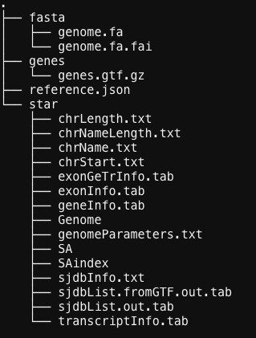
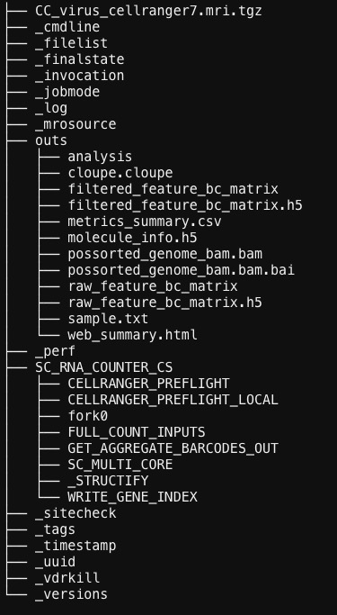
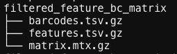

## What it does

This workflow adapts Cell Ranger to detect HPV reads from host single-cell RNA-seq FASTQs. It covers HPV reference construction, Cell Ranger parameter changes for viral genomes, and count-matrix generation against the viral reference.

## When to use it

Use this workflow when the biological question is whether viral transcripts are detectable in single-cell data and you need a viral expression matrix rather than only host-gene counts. It is a preprocessing branch for viral alignment, not a downstream clustering tutorial.

## Prerequisites

- Source folder: [`scRNAseq_HPV_branch`](https://github.com/OSU-BMBL/BMBL-analysis-notebooks/tree/master/scRNAseq_HPV_branch)
- Main files:
  - [`README.md`](https://github.com/OSU-BMBL/BMBL-analysis-notebooks/blob/master/scRNAseq_HPV_branch/README.md)
  - [`cc_hpv_mapping.sh`](https://github.com/OSU-BMBL/BMBL-analysis-notebooks/blob/master/scRNAseq_HPV_branch/cc_hpv_mapping.sh)
- Required inputs:
  - host scRNA-seq FASTQ files
  - the correct HPV reference genome `.fna`
  - a matching HPV annotation `.gtf`

## Steps

### Build a Cell Ranger-compatible HPV reference

The README first walks through unpacking Cell Ranger and using `cellranger mkref` after manually editing the viral annotation so the third column uses `exon` rather than `CDS`.

```bash
$tools/cellranger-7.1.0/cellranger mkref \
  --genome=hpv_ref_genome \
  --fasta=path/to/hpv.fna \
  --genes=path/to/hpv.gtf
```



### Adjust Cell Ranger parameters for a viral genome

Because viruses do not contain introns in the same way host genomes do, the workflow instructs users to edit `parameters.toml` so STAR uses a very small intron limit and a smaller genome index setting.

### Run viral mapping with the modified Cell Ranger build

The committed submission script points a virus-aware Cell Ranger binary at the viral transcriptome reference and FASTQ folder, then runs `count`.

```bash
wd=/fs/scratch/PCON0022/yjl/liuxf/HPV_mapping_results/cellranger7.1
CellRanger=~/tools/cellranger-7.1.0-virus/cellranger
FastqFolder=/fs/scratch/PCON0022/yjl/liuxf/HPV_public_data/GSE168652_RAW/CC_fastq
Refer=/fs/scratch/PCON0022/yjl/liuxf/ref_genome/HPV_18_ref_genome

${CellRanger} count --id=CC_hpv18 --transcriptome=${Refer} --fastqs=${FastqFolder} --sample=CC --chemistry=SC3P_auto --localcores=8 --localmem=64
```

### Inspect the output matrix layout

The README shows the expected output folder and where to find the viral feature-barcode matrix for downstream R or Python analysis.





## Gotchas / notes

- Choosing the correct HPV type is essential; the README explicitly warns that many distinct HPV genomes exist.
- The sample prefix passed to `--sample` must match the FASTQ filename prefix.
- The committed paths assume OSC-style storage and a modified Cell Ranger install dedicated to viral mapping.
- This branch produces a viral gene-expression matrix only; downstream host-plus-virus interpretation is outside the scope of the committed materials.

---
[📄 View source on GitHub](https://github.com/OSU-BMBL/BMBL-analysis-notebooks/tree/master/scRNAseq_HPV_branch)
