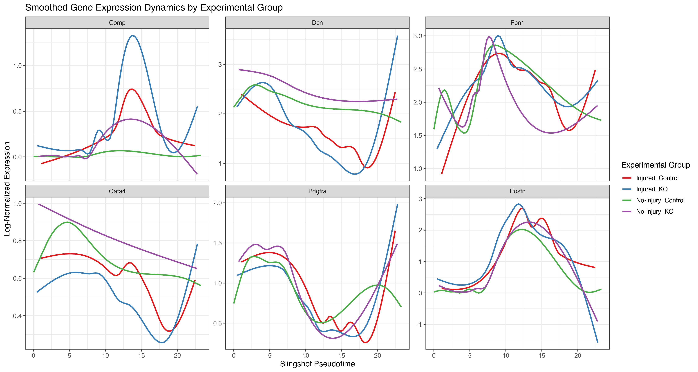

## What it does

This workflow performs trajectory analysis on an existing scRNA-seq Seurat object using Slingshot. It combines cell-type proportion testing, lineage inference, pseudotime visualization, and optional gene-dynamics plotting.

## When to use it

Use this workflow after you already have a normalized and annotated Seurat object with dimensional reduction and sample metadata. It is best suited for questions about progression, differentiation, or condition-specific shifts along a trajectory within selected cell types.

## Prerequisites

- Source folder: [`scRNAseq_trajectory_Slingshot`](https://github.com/OSU-BMBL/BMBL-analysis-notebooks/tree/master/scRNAseq_trajectory_Slingshot)
- Setup script: [`0_install_packages.R`](https://github.com/OSU-BMBL/BMBL-analysis-notebooks/blob/master/scRNAseq_trajectory_Slingshot/0_install_packages.R)
- Main analysis files:
  - [`1_trajectory_slingshot.rmd`](https://github.com/OSU-BMBL/BMBL-analysis-notebooks/blob/master/scRNAseq_trajectory_Slingshot/1_trajectory_slingshot.rmd)
  - [`2_pseudotime_gene_dynamics.R`](https://github.com/OSU-BMBL/BMBL-analysis-notebooks/blob/master/scRNAseq_trajectory_Slingshot/2_pseudotime_gene_dynamics.R)
- Input expectation: a pre-analyzed Seurat object (`.rds` or `.qsave`) with annotations, PCA/UMAP, and group metadata

## Steps

### Define user parameters, inputs, and group assignments

The notebook opens with a parameter block rather than hard-coding one dataset. It expects a processed Seurat object, a metadata field for cell types, sample IDs, and a group column that can be overwritten from sample-level assignments.

```r
DATA_PATH <- "your_seurat.rds"
CELL_TYPE_COL <- "cell_type"
CELL_TYPES_TO_USE <- c("Fibroblasts", "Myofibroblasts")
```

The source notebook also includes a dedicated group-assignment block built from sample ID lists, which is the point where experiment-specific control-versus-treatment definitions are meant to be edited.

### Quantify cell type proportions before the trajectory branch

Before subsetting for Slingshot, the workflow runs a `speckle`-based cell-type proportion comparison and writes those results to CSV. This makes the trajectory page useful even when the main question is whether composition differs across groups.

```r
propeller_results <- propeller(
  clusters = sobj_full[[CELL_TYPE_COL, drop = TRUE]],
  sample = sobj_full[[SAMPLE_ID_COL, drop = TRUE]],
  group = sobj_full[[GROUP_COL, drop = TRUE]]
)
```

### Subset the relevant cell types and re-process them for lineage analysis

After subsetting, the workflow reruns normalization, variable-feature selection, PCA, UMAP, neighbors, and clustering so the trajectory is built on the selected compartment rather than the full atlas.

```r
sobj_fib <- subset(sobj_full, subset = !!sym(CELL_TYPE_COL) %in% CELL_TYPES_TO_USE)
sobj_fib <- NormalizeData(sobj_fib)
sobj_fib <- FindVariableFeatures(sobj_fib)
sobj_fib <- ScaleData(sobj_fib)
sobj_fib <- RunPCA(sobj_fib)
sobj_fib <- RunUMAP(sobj_fib, dims = 1:20)
sobj_fib <- FindNeighbors(sobj_fib, dims = 1:20)
sobj_fib <- FindClusters(sobj_fib, resolution = 0.3)
```

This reprocessing step is followed by cluster UMAPs and group-colored UMAPs so the subset structure can be checked before any pseudotime is inferred.

### Inspect candidate roots with cluster views and marker expression

The notebook does not assume the starting state automatically. It first plots clusters split by group and then visualizes a user-defined marker panel to help decide which cluster should be used as the Slingshot root.

```r
p_group_split <- DimPlot(sobj_fib, reduction = "umap", split.by = GROUP_COL, label = TRUE, ncol = 2)
p_markers <- FeaturePlot(sobj_fib, features = marker_genes, ncol = 2)
```

### Run Slingshot and add pseudotime back into the Seurat object

Once a biologically sensible root cluster is chosen, the notebook converts the object to `SingleCellExperiment`, runs Slingshot, stores pseudotime back in Seurat metadata, and then plots trajectories, densities, and violin plots by group.

```r
sce <- as.SingleCellExperiment(sobj_fib)
sce <- slingshot(sce, clusterLabels = "seurat_clusters", reducedDim = "UMAP", start.clus = start_cluster)
sobj_fib$slingPseudotime_1 <- slingPseudotime(sce)[, 1]
```

The same section then overlays lineage curves on group-colored UMAPs and on pseudotime-colored UMAPs, so users can compare the structural trajectory view with the scalar pseudotime view.

### Compare pseudotime distributions and optionally add gene dynamics

After Slingshot runs, the notebook extracts pseudotime into plotting data frames and produces density and violin plots by condition for each lineage. The companion script extends that branch by drawing smoothed gene-expression dynamics for user-selected genes.

The companion script takes the saved Seurat object, a grouping column, and a gene list to draw smoothed expression trends along pseudotime.



## Gotchas / notes

- The workflow assumes you already know which cell types should be included; poor subsetting will produce misleading trajectories.
- The `start_cluster` choice is manual and should be checked against UMAP structure and marker expression.
- Group assignment is derived from sample IDs in the notebook and often needs editing for a new experiment.
- The committed example figure is available, but most outputs are generated dynamically and are not stored as additional committed PNGs in the repo.

---
[📄 View source on GitHub](https://github.com/OSU-BMBL/BMBL-analysis-notebooks/tree/master/scRNAseq_trajectory_Slingshot)
