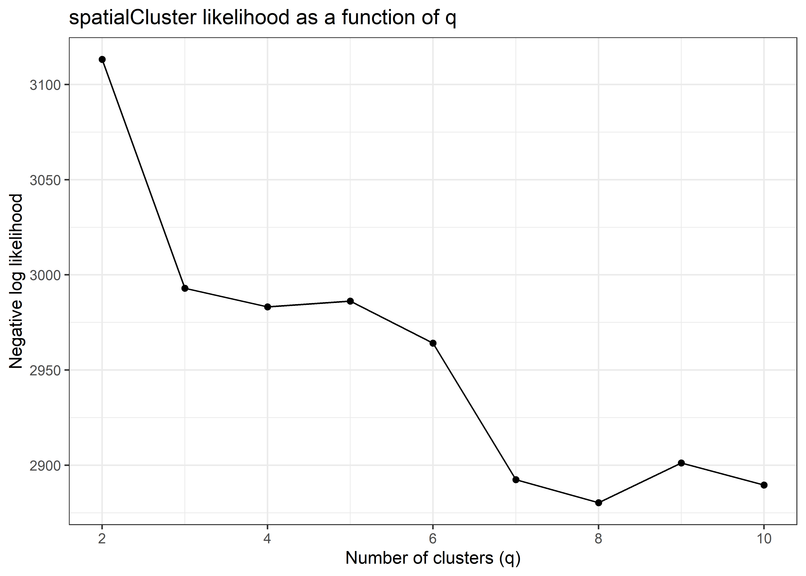
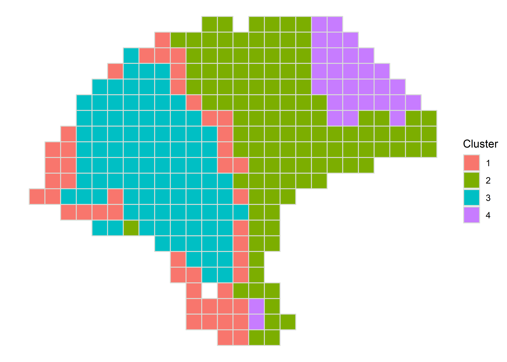
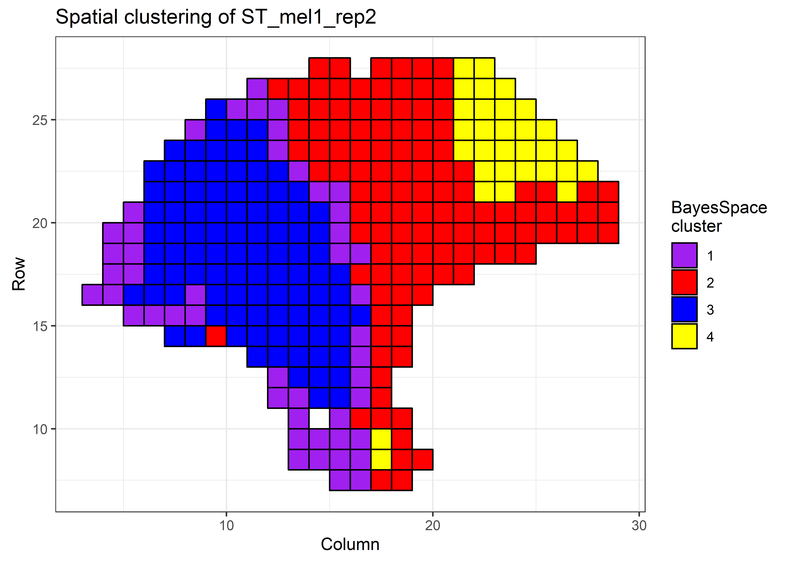
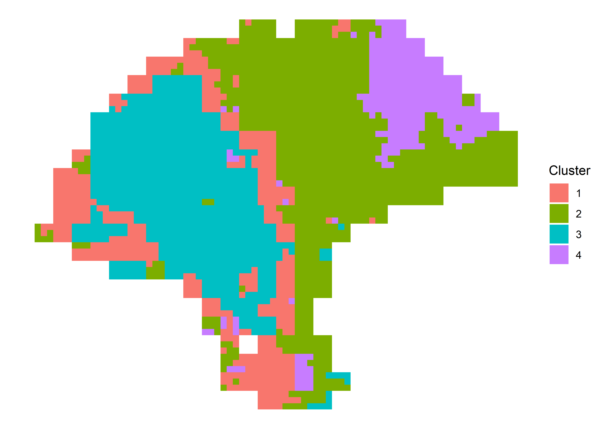
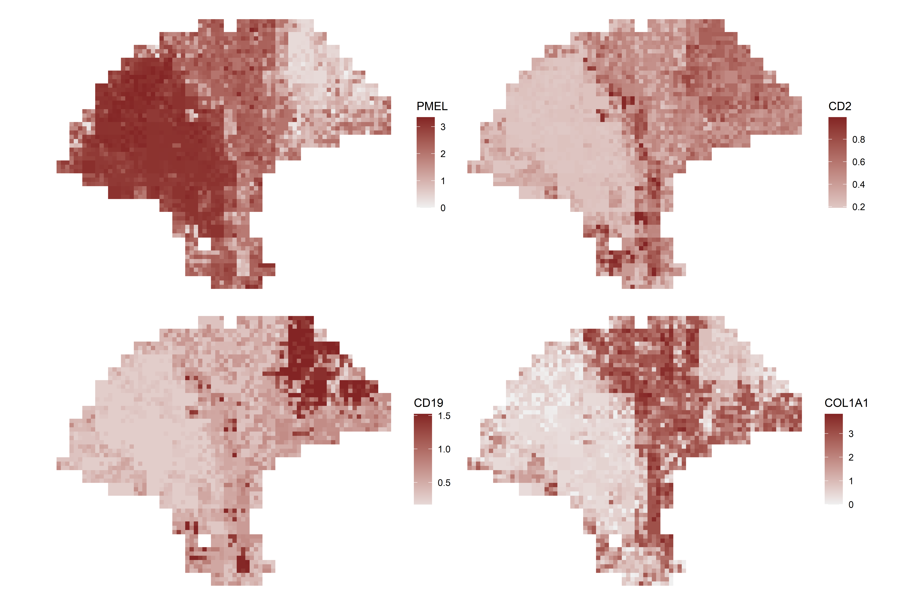
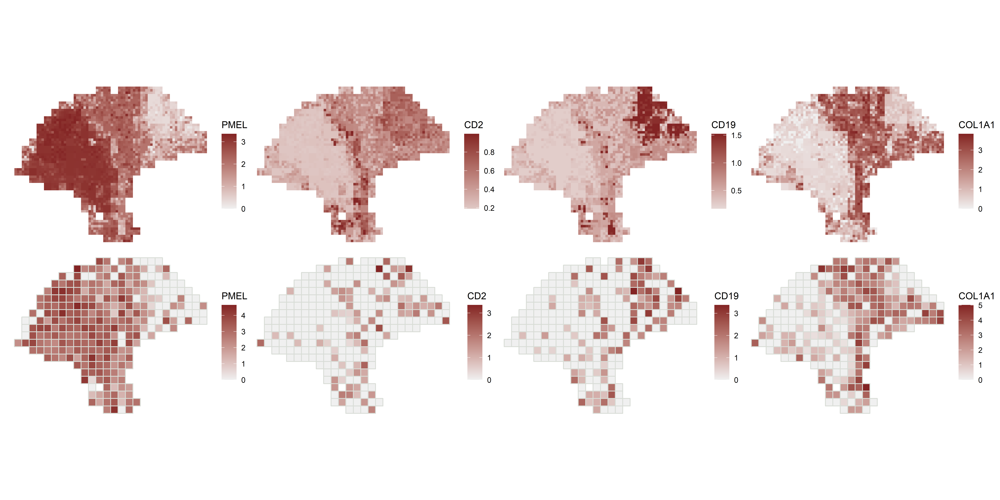

## What it does

This workflow applies BayesSpace to spatial transcriptomics data for spatial clustering and subspot-level resolution enhancement. The committed materials cover `SingleCellExperiment` preparation, cluster-number tuning, spatial clustering, enhanced-resolution modeling, marker-gene imputation, and inspection of saved MCMC chains.

## When to use it

Use this workflow when the main question is spatial domain structure at or below spot resolution and you want a Bayesian spatial model rather than a purely Seurat-style clustering workflow. It is most useful for ST or Visium-like datasets where cluster smoothing, subspot enhancement, and marker-expression imputation are the goals.

## Prerequisites

- Source folder: [`ST_BayesSpace_branch`](https://github.com/OSU-BMBL/BMBL-analysis-notebooks/tree/master/ST_BayesSpace_branch)
- Main files:
  - [`README.md`](https://github.com/OSU-BMBL/BMBL-analysis-notebooks/blob/master/ST_BayesSpace_branch/README.md)
  - [`ST_BayesSpace.rmd`](https://github.com/OSU-BMBL/BMBL-analysis-notebooks/blob/master/ST_BayesSpace_branch/ST_BayesSpace.rmd)
  - rendered reference: [`ST_BayesSpace.html`](https://github.com/OSU-BMBL/BMBL-analysis-notebooks/blob/master/ST_BayesSpace_branch/ST_BayesSpace.html)
- Committed figures in [`ST_BayesSpace_branch/figures`](https://github.com/OSU-BMBL/BMBL-analysis-notebooks/tree/master/ST_BayesSpace_branch/figures)
- Required packages include `BayesSpace`, `SingleCellExperiment`, and `ggplot2`

## Steps

### Load a spatial experiment into a `SingleCellExperiment`

The notebook starts by describing the three accepted entry paths for BayesSpace: `readVisium()` for Space Ranger outputs, `getRDS()` for packaged examples, or manual `SingleCellExperiment` construction from counts plus row/column metadata.

```r
melanoma <- getRDS(dataset = "2018_thrane_melanoma", sample = "ST_mel1_rep2")
```

That example dataset is then used for the rest of the committed tutorial.

### Preprocess the experiment and choose the number of clusters

BayesSpace's helper preprocessing step log-normalizes if needed, keeps highly variable genes, and stores principal components for downstream modeling. The tutorial then uses `qTune()` and `qPlot()` to choose `q`, the number of spatial clusters.

```r
set.seed(102)
melanoma <- spatialPreprocess(
  melanoma,
  platform = "ST",
  n.PCs = 7,
  n.HVGs = 2000,
  log.normalize = FALSE
)

melanoma <- qTune(melanoma, qs = seq(2, 10), platform = "ST", d = 7)
qPlot(melanoma)
```



### Run spatial clustering and inspect the resulting domains

Once `q` is selected, the workflow runs `spatialCluster()` with a spatial prior and stores both the initialization and the final BayesSpace cluster assignments in `colData`.

```r
set.seed(149)
melanoma <- spatialCluster(
  melanoma,
  q = 4,
  platform = "ST",
  d = 7,
  init.method = "mclust",
  model = "t",
  gamma = 2,
  nrep = 1000,
  burn.in = 100,
  save.chain = TRUE
)
```

The committed figures show both the default spatial cluster plot and a customized version with explicit colors and borders.

::: {.grid}
::: {.g-col-12 .g-col-lg-6}

:::
::: {.g-col-12 .g-col-lg-6}

:::
:::

### Enhance resolution to the subspot level

The next branch runs `spatialEnhance()` to infer subspot-level principal components and cluster assignments. This is one of the main reasons to use BayesSpace over a simpler spatial clustering workflow.

```r
melanoma.enhanced <- spatialEnhance(
  melanoma,
  q = 4,
  platform = "ST",
  d = 7,
  model = "t",
  gamma = 2,
  jitter_prior = 0.3,
  jitter_scale = 3.5,
  nrep = 1000,
  burn.in = 100,
  save.chain = TRUE
)
```



### Impute marker-gene expression and compare spot versus subspot views

Because BayesSpace enhances PCs rather than gene counts directly, the tutorial next uses `enhanceFeatures()` to impute selected marker genes at subspot resolution.

```r
markers <- c("PMEL", "CD2", "CD19", "COL1A1")
melanoma.enhanced <- enhanceFeatures(
  melanoma.enhanced,
  melanoma,
  feature_names = markers,
  nrounds = 0
)
```

The committed figures then compare enhanced marker expression panels with the original spot-level views.

::: {.grid}
::: {.g-col-12 .g-col-lg-6}

:::
::: {.g-col-12 .g-col-lg-6}

:::
:::

### Inspect saved Markov chains when needed

The notebook closes by documenting how to read the saved MCMC chain with `mcmcChain()` when `save.chain = TRUE`, or remove it with `removeChain()`.

```r
chain <- mcmcChain(melanoma)
chain[1:5, 1:5]
```

This is a useful workflow-specific detail because BayesSpace exposes its iterative Bayesian fit in a way that the other spatial branches do not.

## Gotchas / notes

- The demo reduces iteration counts for runtime, but the committed notebook explicitly recommends much larger `nrep` values for real analyses.
- Enhancement relies on principal components and then imputes expression afterward; it does not directly model subspot gene counts from the start.
- The README refers to a differently named Rmd in one place, but the committed executable tutorial file in this repo is `ST_BayesSpace.rmd`.
- The bundled example data are specific to the BayesSpace tutorial; readers using Visium outputs should switch to `readVisium()`.

---
[📄 View source on GitHub](https://github.com/OSU-BMBL/BMBL-analysis-notebooks/tree/master/ST_BayesSpace_branch)
