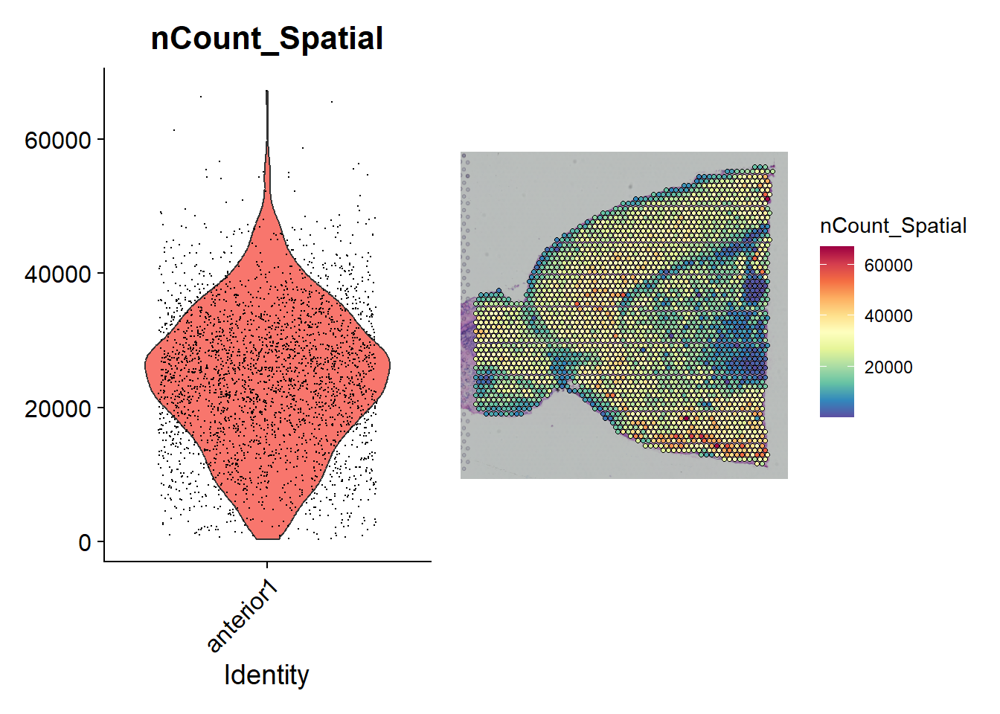
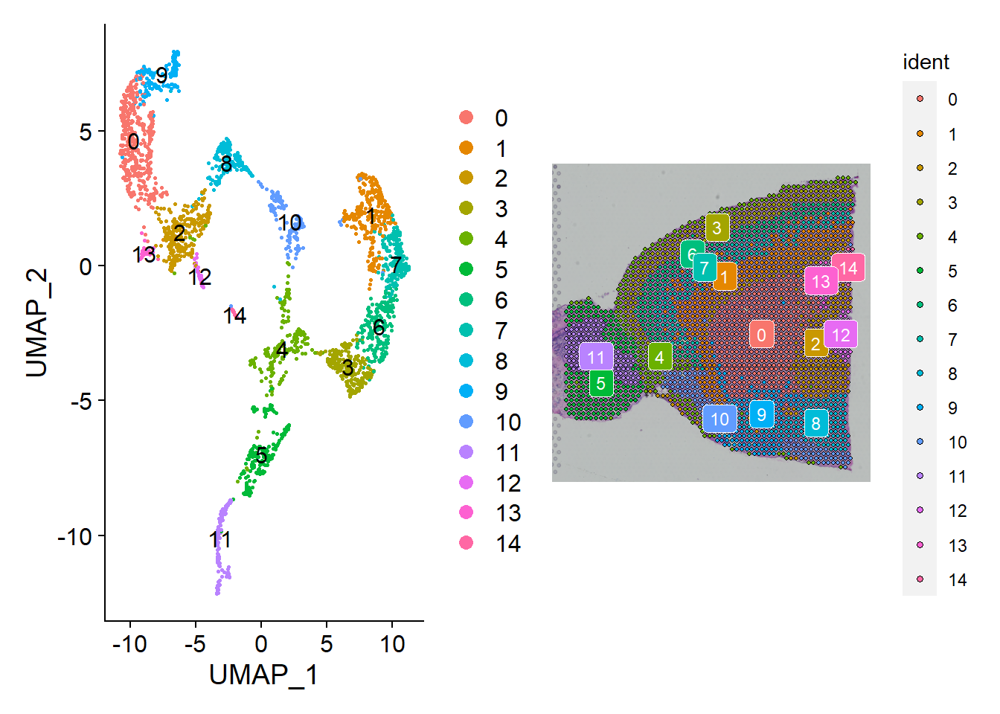
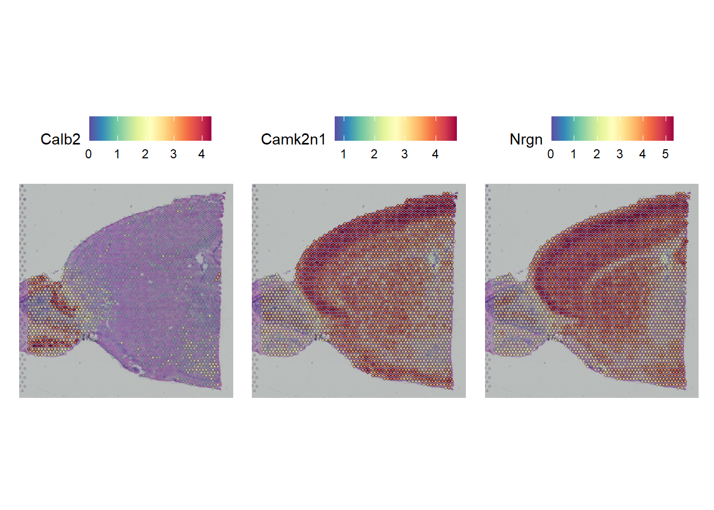

## What it does

This workflow is the lab's general Seurat-based reference for spatial transcriptomics analysis. The committed materials cover Visium-style preprocessing, spatial gene visualization, clustering, spatially variable feature detection, anatomical subsetting, integration with a single-cell RNA-seq reference, multi-slice analysis, and separate notes for cell-type deconvolution with RCTD and TACCO.

## When to use it

Use this workflow when you need a general Seurat path for analyzing Visium or similar spatial transcriptomics data and want an example that stays close to the Satija Lab spatial workflow. It is most useful when the main needs are clustering, spatial feature analysis, reference label transfer, and basic multi-slice handling, with optional follow-up deconvolution notes in the same folder.

## Prerequisites

- Source folder: [`ST_general_workflow`](https://github.com/OSU-BMBL/BMBL-analysis-notebooks/tree/master/ST_general_workflow)
- Main files:
  - [`README.md`](https://github.com/OSU-BMBL/BMBL-analysis-notebooks/blob/master/ST_general_workflow/README.md)
  - [`Sequencing_Analysis/ST_general_workflow_tutorial.Rmd`](https://github.com/OSU-BMBL/BMBL-analysis-notebooks/blob/master/ST_general_workflow/Sequencing_Analysis/ST_general_workflow_tutorial.Rmd)
  - [`cell type deconv/Spatial cell type deconvolution using RCTD.md`](https://github.com/OSU-BMBL/BMBL-analysis-notebooks/blob/master/ST_general_workflow/cell%20type%20deconv/Spatial%20cell%20type%20deconvolution%20using%20RCTD.md)
  - [`cell type deconv/Spatial cell type deconvolution using TACCO.md`](https://github.com/OSU-BMBL/BMBL-analysis-notebooks/blob/master/ST_general_workflow/cell%20type%20deconv/Spatial%20cell%20type%20deconvolution%20using%20TACCO.md)
- Required package stack centered on `Seurat`, `SeuratData`, `ggplot2`, `patchwork`, `dplyr`, and optionally `glmGamPoi`
- Expected inputs:
  - spatial Seurat object such as `stxBrain`
  - preannotated single-cell RNA-seq reference for label transfer
  - optional histology image

## Steps

### Load the spatial dataset and normalize the tissue spots

The tutorial begins with Seurat's example mouse brain spatial dataset, visualizes spot-level counts, and normalizes the spatial assay with `SCTransform()`.

```r
InstallData("stxBrain")
brain <- LoadData("stxBrain", type = "anterior1")

plot1 <- VlnPlot(brain, features = "nCount_Spatial", pt.size = 0.1) + NoLegend()
plot2 <- SpatialFeaturePlot(brain, features = "nCount_Spatial") + theme(legend.position = "right")
wrap_plots(plot1, plot2)

brain <- SCTransform(brain, assay = "Spatial", verbose = FALSE)
```



### Visualize marker genes and run spatial clustering

The next section uses example marker genes such as `Hpca` and `Ttr`, then applies the familiar Seurat RNA workflow to the spatial assay: PCA, neighbors, clusters, and UMAP.

```r
SpatialFeaturePlot(brain, features = c("Hpca", "Ttr"))

brain <- RunPCA(brain, assay = "SCT", verbose = FALSE)
brain <- FindNeighbors(brain, reduction = "pca", dims = 1:30)
brain <- FindClusters(brain, verbose = FALSE)
brain <- RunUMAP(brain, reduction = "pca", dims = 1:30)
```

The tutorial then compares the same clusters in both UMAP space and tissue space, which is one of the main advantages of this reference workflow.



### Detect spatially variable features and subset anatomical regions

After clustering, the notebook finds differential markers between anatomical regions and then searches for spatially variable features without relying only on pre-annotated labels. It also demonstrates how to subset a cortex region based on cluster identity and tissue coordinates in Seurat v5-compatible code.

```r
de_markers <- FindMarkers(brain, ident.1 = 5, ident.2 = 6)

brain <- FindSpatiallyVariableFeatures(
  brain,
  assay = "SCT",
  features = VariableFeatures(brain)[1:1000],
  selection.method = "markvariogram"
)

coords <- GetTissueCoordinates(brain)
coords <- coords[colnames(brain), ]
brain$x <- coords$x
brain$y <- coords$y
```

The committed notebook preserves both old and new subsetting code, but clearly prefers the newer coordinate-based version for Seurat `5.3.0`.

### Transfer labels from a single-cell RNA-seq reference

The richer interpretation step preprocesses an Allen cortex single-cell reference, renormalizes the cortex subset, and transfers labels into the spatial object with anchor-based mapping.

```r
allen_subset <- SCTransform(
  allen_subset,
  assay = "RNA",
  method = "glmGamPoi",
  vst.flavor = "v2",
  verbose = TRUE
)

anchors <- FindTransferAnchors(
  reference = allen_reference,
  query = cortex,
  normalization.method = "SCT"
)
predictions.assay <- TransferData(
  anchorset = anchors,
  refdata = allen_reference$subclass,
  prediction.assay = TRUE,
  weight.reduction = cortex[["pca"]],
  dims = 1:30
)
cortex[["predictions"]] <- predictions.assay
```

This is also where the workflow surfaces one of its main practical tweaks: using `glmGamPoi` to make the SCT preprocessing of the reference more manageable.

### Explore predicted spatial cell types and work with multiple slices

The later sections plot predicted neuronal subclasses in tissue space and then load a second slice to show how multiple spatial sections can be merged and analyzed together.

```r
DefaultAssay(cortex) <- "predictions"
SpatialFeaturePlot(cortex, features = c("L2/3 IT", "L4"), pt.size.factor = 1.6, ncol = 2, crop = TRUE)

brain2 <- LoadData("stxBrain", type = "posterior1")
brain2 <- SCTransform(brain2, assay = "Spatial", verbose = FALSE)
brain.merge <- merge(brain, brain2)
```



### Use the folder's deconvolution notes for RCTD and TACCO follow-up

In addition to the main Seurat spatial notebook, this folder includes committed markdown notes for two deconvolution branches. The RCTD note shows a `spacexr`-based workflow that reads spatial and single-cell Seurat objects, constructs `Reference()` and `SpatialRNA()` objects, and exports per-sample weights, while the TACCO note documents the expected inputs and points to a Python notebook-based workflow.

```r
reference <- Reference(sc_counts, cell_types = cell_types)
spatial <- SpatialRNA(coords, sp_counts_sample)

rctd <- create.RCTD(spatial, reference, max_cores = 16)
rctd <- run.RCTD(rctd)
results <- rctd@results$weights
```

Those deconvolution notes are thinner than the main sequencing tutorial, but they are still part of the committed spatial-general source material and useful as branch references.

## Gotchas / notes

- The main tutorial depends on example datasets from `SeuratData` plus an external Allen cortex reference file that is not committed in this repo.
- Interactive spatial plots are documented, but they require an RStudio session rather than static site rendering.
- The notebook preserves both older and newer Seurat code paths; the newer coordinate-based cortex subsetting is the intended version for recent Seurat releases.
- The RCTD and TACCO deconvolution notes are more like branch references than full notebook walkthroughs, and TACCO points to a notebook that is not committed in this folder.

---
[📄 View source on GitHub](https://github.com/OSU-BMBL/BMBL-analysis-notebooks/tree/master/ST_general_workflow)
