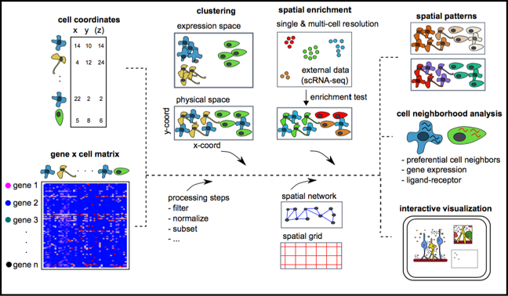
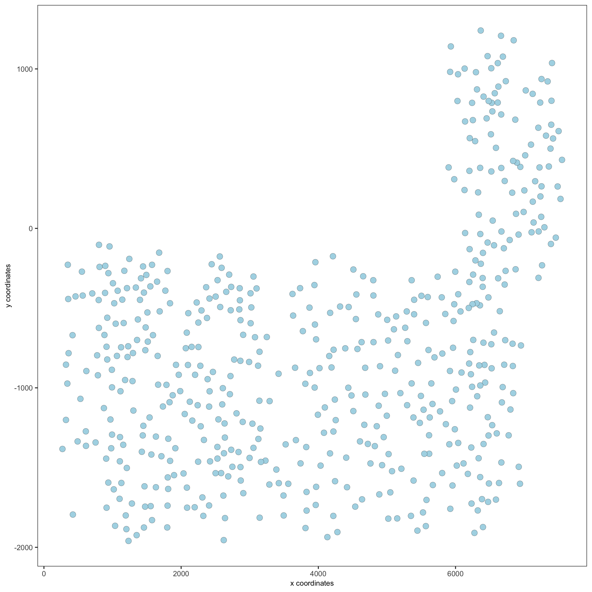
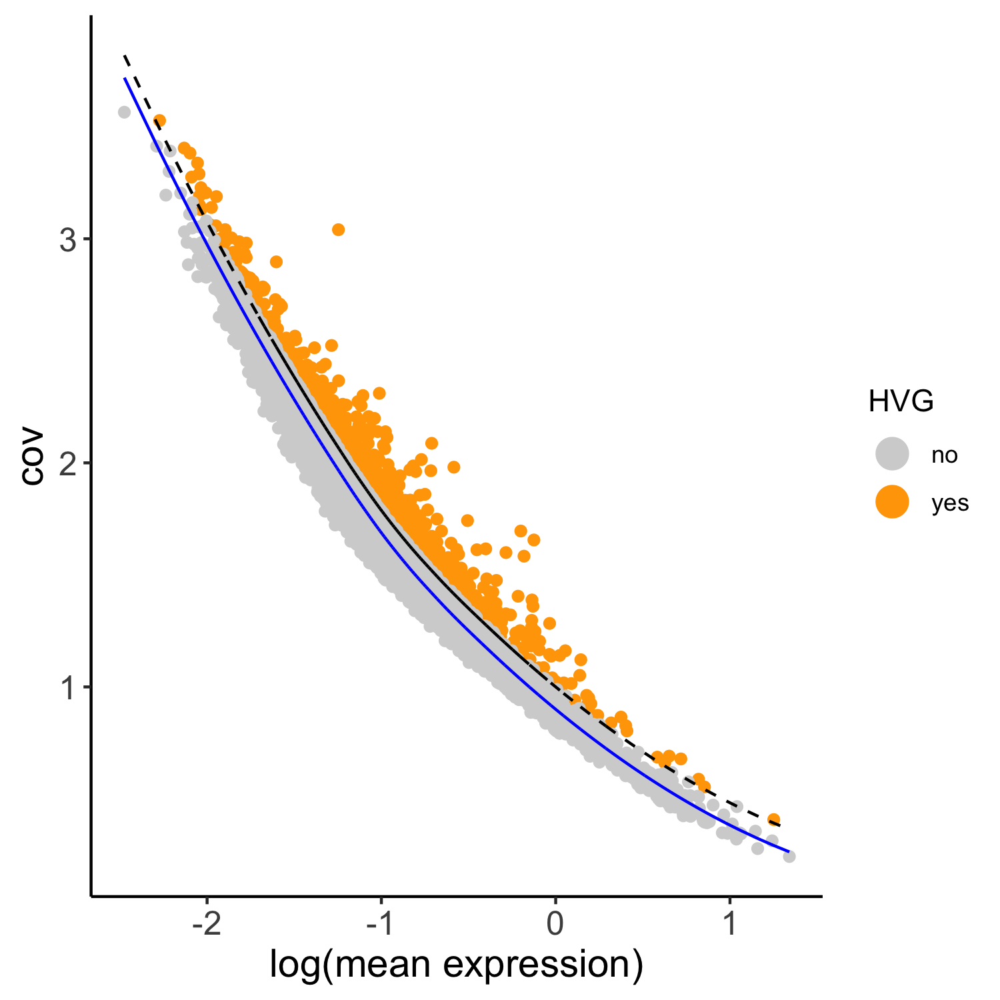
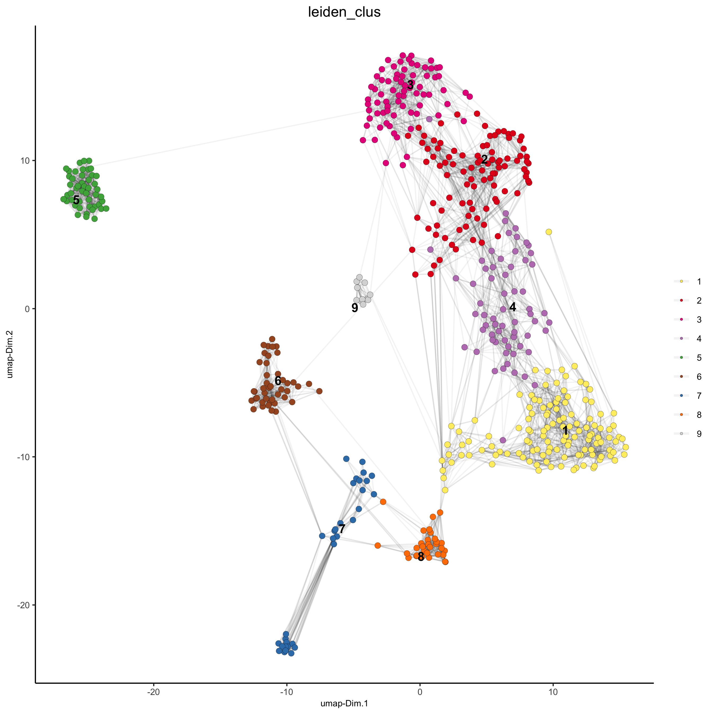
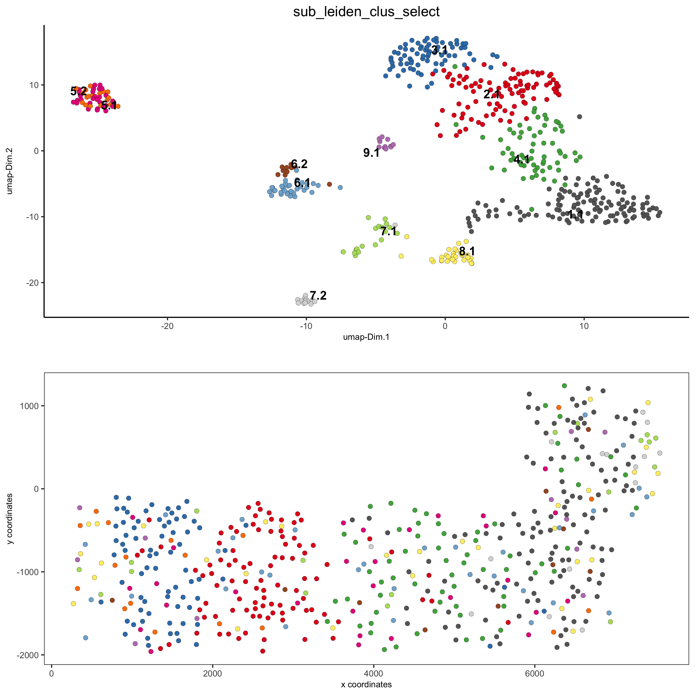

## What it does

This workflow uses Giotto for an end-to-end spatial transcriptomics analysis that goes well beyond basic clustering. The committed materials cover object creation, filtering, normalization, dimensional reduction, clustering, marker discovery, annotation, spatial network modeling, spatial gene detection, co-expression analysis, HMRF domains, and neighborhood-level cell-cell interaction analysis.

## When to use it

Use this workflow when you want a Giotto-native analysis rather than a Seurat-based spatial workflow, especially for seqFISH-like data or projects where spatial networks, HMRF domains, and neighborhood interaction analysis are central. It is strongest as a broad reference for Giotto's modeling vocabulary and plotting ecosystem.

## Prerequisites

- Source folder: [`ST_giotto_branch`](https://github.com/OSU-BMBL/BMBL-analysis-notebooks/tree/master/ST_giotto_branch)
- Main files:
  - [`README.md`](https://github.com/OSU-BMBL/BMBL-analysis-notebooks/blob/master/ST_giotto_branch/README.md)
  - [`Spatial-giotto.Rmd`](https://github.com/OSU-BMBL/BMBL-analysis-notebooks/blob/master/ST_giotto_branch/Spatial-giotto.Rmd)
  - rendered reference: [`Spatial-giotto.html`](https://github.com/OSU-BMBL/BMBL-analysis-notebooks/blob/master/ST_giotto_branch/Spatial-giotto.html)
- Committed figure assets in [`ST_giotto_branch/img`](https://github.com/OSU-BMBL/BMBL-analysis-notebooks/tree/master/ST_giotto_branch/img)
- Required packages include `Giotto` and its supporting R/Python environment

## Steps

### Create the Giotto object and set analysis instructions

The workflow begins by loading `Giotto`, setting optional instructions for figure output, and constructing a Giotto object from an expression matrix plus spatial coordinates.

```r
library(Giotto)

temp_dir = '~/Temp/'
myinstructions = createGiottoInstructions(
  save_dir = temp_dir,
  save_plot = FALSE,
  show_plot = F
)

expr_path = "/data/data/seqfish_field_expr.txt.gz"
loc_path = "/data/data/seqfish_field_locs.txt"
seqfish_mini <- createGiottoObject(raw_exprs = expr_path, spatial_locs = loc_path)
```

The tutorial's stated focus is a "mini seqFISH" dataset, which distinguishes it from the Visium-style Seurat workflows elsewhere in the site.



### Filter, normalize, and reduce dimensions

The next stages filter low-information genes/cells, normalize counts, add summary statistics, and perform PCA, UMAP, and tSNE after highly variable gene selection.

```r
seqfish_mini <- filterGiotto(
  gobject = seqfish_mini,
  expression_threshold = 0.5,
  gene_det_in_min_cells = 20,
  min_det_genes_per_cell = 0
)
seqfish_mini <- normalizeGiotto(gobject = seqfish_mini, scalefactor = 6000, verbose = T)
seqfish_mini <- addStatistics(gobject = seqfish_mini)
seqfish_mini <- calculateHVG(gobject = seqfish_mini)
seqfish_mini <- runPCA(gobject = seqfish_mini)
seqfish_mini <- runUMAP(seqfish_mini, dimensions_to_use = 1:5, n_threads = 2)
```

::: {.grid}
::: {.g-col-12 .g-col-lg-6}

:::
::: {.g-col-12 .g-col-lg-6}

:::
:::

### Cluster cells and annotate broad cell types

Giotto then builds a nearest-neighbor graph, runs Leiden clustering, visualizes the clusters in both latent and spatial space, and defines a simple annotation mapping from cluster IDs to example cell types.

```r
seqfish_mini <- createNearestNetwork(gobject = seqfish_mini, dimensions_to_use = 1:5, k = 5)
seqfish_mini <- doLeidenCluster(gobject = seqfish_mini, resolution = 0.4, n_iterations = 1000)

clusters_cell_types = c('cell A', 'cell B', 'cell C', 'cell D',
                        'cell E', 'cell F', 'cell G', 'cell H')
names(clusters_cell_types) = 1:8
seqfish_mini = annotateGiotto(
  gobject = seqfish_mini,
  annotation_vector = clusters_cell_types,
  cluster_column = 'leiden_clus',
  name = 'cell_types'
)
```



### Build spatial grids and networks, then find spatial genes

The middle of the notebook leans into Giotto's spatial-analysis strengths: create a spatial grid, build Delaunay and kNN spatial networks, and identify spatial genes using `binSpect()` and `silhouetteRank()`.

```r
seqfish_mini <- createSpatialGrid(
  gobject = seqfish_mini,
  sdimx_stepsize = 300,
  sdimy_stepsize = 300,
  minimum_padding = 50
)

seqfish_mini = createSpatialNetwork(
  gobject = seqfish_mini,
  minimum_k = 2,
  maximum_distance_delaunay = 400
)

km_spatialgenes = binSpect(seqfish_mini)
rank_spatialgenes = binSpect(seqfish_mini, bin_method = 'rank')
silh_spatialgenes = silhouetteRank(gobject = seqfish_mini)
```

This is a good example of where Giotto differs from the Seurat spatial workflow: the committed analysis is much more explicit about spatial graph construction as a first-class object.

### Model co-expression patterns, HMRF domains, and neighborhood interactions

The later sections extend from spatial genes into metagene discovery, HMRF spatial domains, neighborhood enrichment, changed genes, and ligand-receptor communication.

```r
spat_cor_netw_DT = detectSpatialCorGenes(
  seqfish_mini,
  method = 'network',
  spatial_network_name = 'Delaunay_network',
  subset_genes = ext_spatial_genes
)
spat_cor_netw_DT = clusterSpatialCorGenes(
  spat_cor_netw_DT,
  name = 'spat_netw_clus',
  k = 8
)
```

The README's output list makes these advanced neighborhood and communication analyses a core part of the branch rather than a side note.



## Gotchas / notes

- The notebook uses hard-coded example paths under `/data`, so readers will need to replace those with their own matrix and coordinate paths.
- Giotto requires its own software environment and can involve R/Python setup complexity that the Seurat-based branches avoid.
- The README refers to a differently named main Rmd in one place, but the committed tutorial file in this repo is `Spatial-giotto.Rmd`.
- The cell-type annotation mapping in the tutorial is clearly an example placeholder rather than a finalized biological annotation.

---
[📄 View source on GitHub](https://github.com/OSU-BMBL/BMBL-analysis-notebooks/tree/master/ST_giotto_branch)
