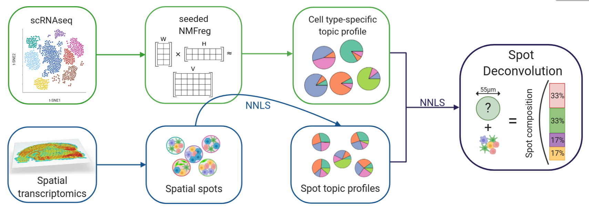
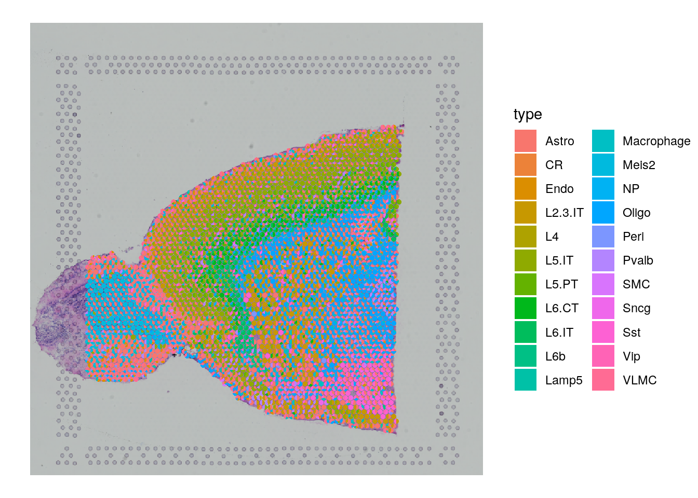
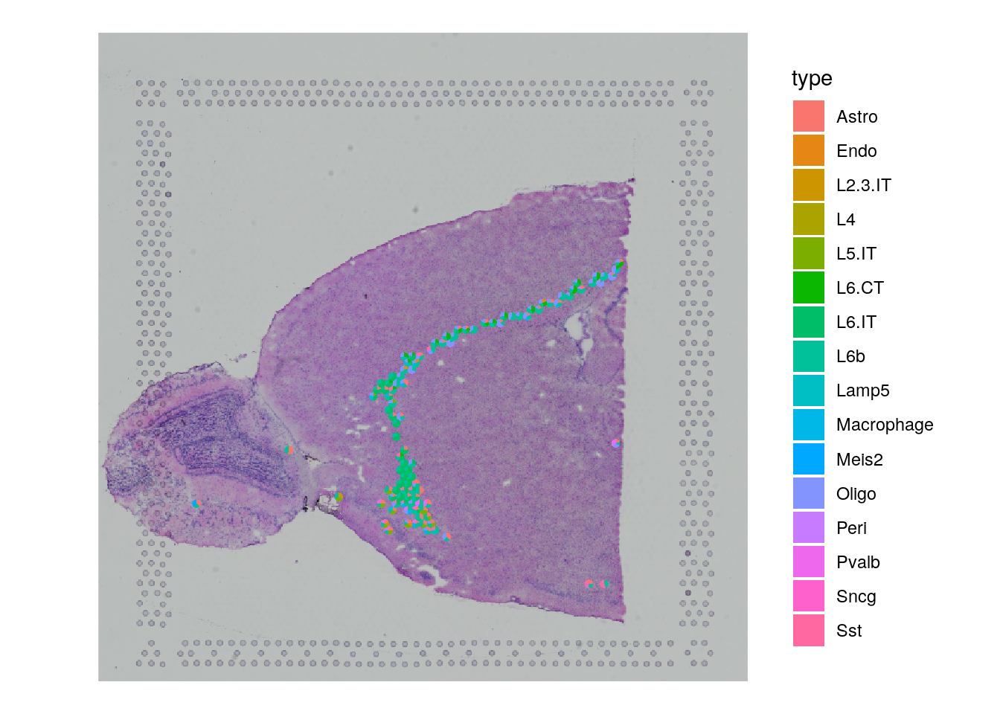
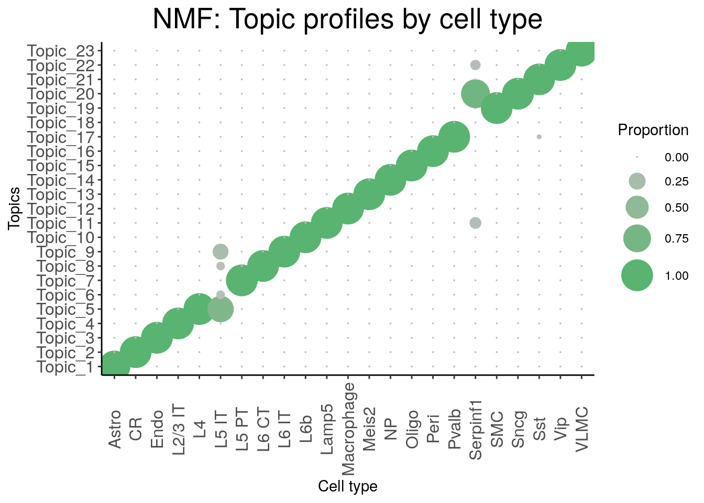

## What it does

This workflow applies SPOTlight to deconvolute spatial transcriptomics spots into single-cell-derived cell-type proportions. The committed materials cover preprocessing of a single-cell reference and a spatial Seurat object, marker selection, SPOTlight deconvolution, scatterpie-style spot composition plots, interaction graphs, and topic-profile inspection.

## When to use it

Use this workflow when the main question is cell-type composition per spot rather than only spatial clustering. It is most useful when you have a well-annotated single-cell RNA-seq reference, a spatial capture dataset such as Visium, and want a seeded NMF-based deconvolution path.

## Prerequisites

- Source folder: [`ST_spotlight_branch`](https://github.com/OSU-BMBL/BMBL-analysis-notebooks/tree/master/ST_spotlight_branch)
- Main files:
  - [`README.md`](https://github.com/OSU-BMBL/BMBL-analysis-notebooks/blob/master/ST_spotlight_branch/README.md)
  - [`ST_Spotlight.Rmd`](https://github.com/OSU-BMBL/BMBL-analysis-notebooks/blob/master/ST_spotlight_branch/ST_Spotlight.Rmd)
  - rendered reference: [`ST_Spotlight.html`](https://github.com/OSU-BMBL/BMBL-analysis-notebooks/blob/master/ST_spotlight_branch/ST_Spotlight.html)
- Committed images in [`ST_spotlight_branch/img`](https://github.com/OSU-BMBL/BMBL-analysis-notebooks/tree/master/ST_spotlight_branch/img) and rendered figure assets under [`ST_spotlight_branch/man/figures`](https://github.com/OSU-BMBL/BMBL-analysis-notebooks/tree/master/ST_spotlight_branch/man/figures)
- Required packages include `SPOTlight`, `Seurat`, `NMF`, `igraph`, `RColorBrewer`, and `dplyr`

## Steps

### Load the single-cell reference and spatial Seurat object

The tutorial starts from an Allen cortex single-cell reference plus the `stxBrain` mouse spatial dataset, preprocessing each with Seurat before deconvolution.

```r
library(SPOTlight)
library(Seurat)
library(dplyr)
library(SeuratData)

cortex_sc <- readRDS("data/allen_cortex_dwn.rds")
cortex_sc <- Seurat::SCTransform(cortex_sc, verbose = FALSE)
cortex_sc <- Seurat::RunPCA(cortex_sc, verbose = FALSE)
cortex_sc <- Seurat::RunUMAP(cortex_sc, dims = 1:30, verbose = FALSE)

anterior <- LoadData("stxBrain.SeuratData", type = "anterior1")
anterior <- Seurat::SCTransform(anterior, assay = "Spatial", verbose = FALSE)
anterior <- Seurat::RunPCA(anterior, verbose = FALSE)
```



### Define marker genes for the reference cell types

The deconvolution model depends on cluster-specific marker genes from the single-cell reference. The notebook shows how to compute them with `FindAllMarkers()`, then reads a committed marker file for the demo.

```r
Seurat::Idents(object = cortex_sc) <- cortex_sc@meta.data$subclass
cluster_markers_all <- Seurat::FindAllMarkers(
  object = cortex_sc,
  assay = "SCT",
  slot = "data",
  only.pos = TRUE,
  logfc.threshold = 1,
  min.pct = 0.9
)
```

```r
cluster_markers_all <- readRDS("data/markers_sc.RDS")
```

The committed notebook is explicit that strong, specific markers are part of the speed-versus-accuracy tradeoff for SPOTlight model training.

### Run SPOTlight deconvolution and extract the composition matrix

The core step uses `spotlight_deconvolution()` to combine the single-cell reference, spatial counts, and marker list. For the demo, the notebook loads a committed deconvolution result from disk and extracts the cell-type proportion matrix.

```r
spotlight_ls <- spotlight_deconvolution(
  se_sc = cortex_sc,
  counts_spatial = anterior@assays$Spatial@counts,
  clust_vr = "subclass",
  cluster_markers = cluster_markers_all,
  cl_n = 50,
  hvg = 3000,
  ntop = NULL,
  transf = "uv",
  method = "nsNMF",
  min_cont = 0.09
)
```

```r
spotlight_ls <- readRDS(file = "data/spotlight_ls_anterior.RDS")
decon_mtrx <- spotlight_ls[[2]]
cell_types_all <- colnames(decon_mtrx)[which(colnames(decon_mtrx) != "res_ss")]
```

### Visualize spot composition and predicted spatial patterns

Once the deconvolution matrix is available, the workflow adds it to the Seurat metadata and uses `spatial_scatterpie()` to visualize mixed cell-type composition across the tissue. It then plots specific cell types with `SpatialFeaturePlot()`.

```r
anterior@meta.data <- cbind(anterior@meta.data, decon_mtrx)

SPOTlight::spatial_scatterpie(
  se_obj = anterior,
  cell_types_all = cell_types_all,
  img_path = "img/tissue_lowres_image.png",
  pie_scale = 0.4
)

SpatialFeaturePlot(
  anterior,
  features = "L6b",
  pt.size.factor = 1,
  alpha = c(0, 1)
)
```

::: {.grid}
::: {.g-col-12 .g-col-lg-6}

:::
::: {.g-col-12 .g-col-lg-6}

:::
:::

### Build a spatial interaction graph and inspect topic profiles

The later sections summarize cell-type co-occurrence with `get_spatial_interaction_graph()` and inspect topic profiles from the underlying NMF model to see where cell types may be confounded.

```r
graph_ntw <- get_spatial_interaction_graph(decon_mtrx = decon_mtrx[, cell_types_all])

nmf_mod_ls <- spotlight_ls[[1]]
nmf_mod <- nmf_mod_ls[[1]]
h <- NMF::coef(nmf_mod)
rownames(h) <- paste("Topic", 1:nrow(h), sep = "_")
topic_profile_plts <- dot_plot_profiles_fun(h = h, train_cell_clust = nmf_mod_ls[[2]])
```

The notebook then goes further with step-by-step internals for downsampling, NMF training, basis/coef extraction, and non-negative least-squares spot deconvolution, which makes this branch stronger than a black-box "run one function" example.



## Gotchas / notes

- The workflow depends on external or precomputed reference files such as `allen_cortex_dwn.rds`, `markers_sc.RDS`, and `spotlight_ls_anterior.RDS`.
- The README refers to a differently named main Rmd in one place, but the committed tutorial file in this repo is `ST_Spotlight.Rmd`.
- The notebook includes both the fast "load a precomputed result" path and the slower full deconvolution path; readers need to choose which matches their use case.
- SPOTlight is only as strong as the reference annotations and marker genes supplied to the model.

---
[📄 View source on GitHub](https://github.com/OSU-BMBL/BMBL-analysis-notebooks/tree/master/ST_spotlight_branch)
